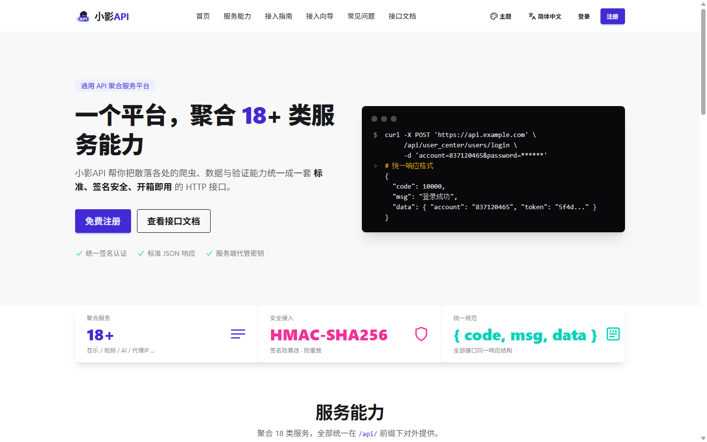
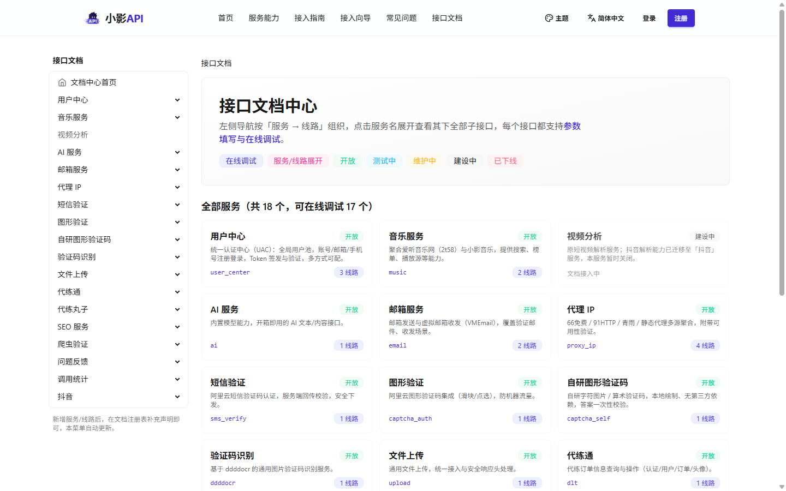
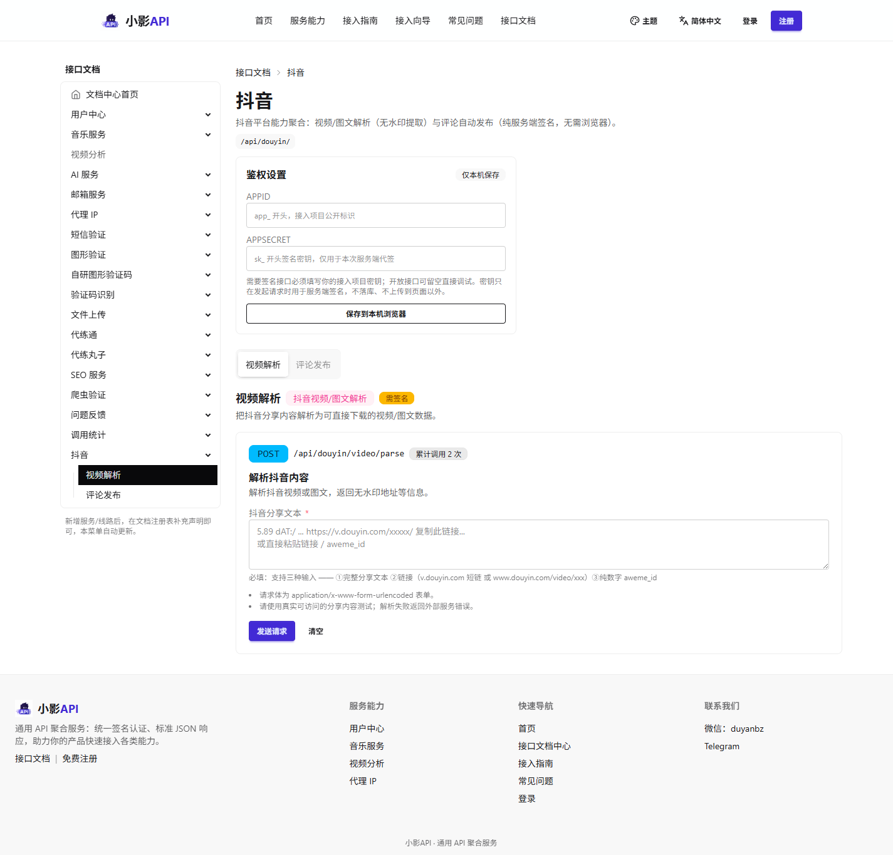

# 小影 API（XiaoYingAPI）

一个致力于构建通用 API 服务的项目，基于 Django 聚合了爬虫、AI、代理 IP、音乐、短视频、SEO、用户中心等多个领域的 API 服务，统一接入签名认证与标准响应格式。



**核心特性**

- **统一的 API 契约**：所有服务共用 `{code, msg, data}` 响应结构与 `API/common/status_code.py` 状态码体系
- **分类树认证（fail-closed）**：按服务路径配置「需要认证 / 开放 / 跟随上级」；未显式配置的服务默认拒绝匿名访问
- **开箱即用的接口文档中心**：声明式描述「服务 → 线路 → 端点 → 参数」，自动生成文档页、侧栏导航与在线调试（服务端代签，浏览器不接触密钥）
- **自带官网前台**：首页、接入向导、统一登录注册、超级管理员控制台，无需额外后台
- **多语言 + 多主题**：简体中文 / 繁體中文 / English；35 款 daisyUI 主题可切换
- **调用统计**：按天预聚合的调用量看板 + 公开查询接口
- **前端零 Node 构建链**：daisyUI 5 + Tailwind 4 由独立可执行文件编译，不需要 npm（**注**：抖音评论线路运行时需要 Node.js，见第三章）

***

## 一、技术栈

| 组件                              | 说明                                                     |
| ------------------------------- | ------------------------------------------------------ |
| Python / Django                 | 后端框架（实测运行版本 Django 6.0.6）                              |
| SQLite                          | 默认数据库（`db.sqlite3`，已配置 20s 写锁等待）                        |
| daisyUI 5 / Tailwind 4          | 官网前端样式（独立可执行文件编译，**前端无 Node 构建链**）                      |
| Django i18n                     | 多语言（简体中文 / 繁体中文 / English），词条见 `locale/`               |
| Node.js                         | **仅抖音评论线路的运行时依赖**（≥ 18，用于本地补环境生成请求签名，见第三章）             |
| django-cors-headers             | 跨域请求支持                                                 |
| whitenoise                      | 生产模式静态文件服务                                             |
| requests / httpx / lxml         | HTTP 请求与网页解析                                            |
| pycryptodome                    | 加解密（Crypto）                                             |
| ddddocr                         | 验证码识别                                                  |
| python-dotenv                   | 环境变量加载（`.env`）                                         |
| zhconv                          | 仅构建期：由简体词条生成繁体词条（运行时不依赖）                               |

> 原 `django-simpleui` + `django.contrib.admin` 后台**已整体移除**（访问 `/admin/` 返回 404），管理入口改为官网自带的「超级管理员控制台」（见第七章）。

***

## 二、目录结构

```
XiaoYingAPI/
├── manage.py                     # Django 管理入口（runserver / migrate / collectstatic / createsuperuser）
├── requirements.txt              # Python 依赖清单
├── .env.example                  # 环境变量模板（复制为 .env 后填写，见第五章）
├── XiaoYingAPI/                  # 项目配置：settings / urls（根路由 + 错误页兜底）/ wsgi / asgi
├── API/                          # 主应用：后端业务 + 官网前端（注册于 INSTALLED_APPS）
│   ├── apis/                     # 各业务 API 服务「三件套」，路由汇总在 apis/urls.py
│   ├── common/                   # 公共模块，全站复用，禁止在业务里重复实现
│   ├── models/                   # 数据模型（按业务域分目录，规则见其目录内 数据库模型创建规则.md）
│   ├── website/                  # 官网前台：首页 / 接入向导 / 登录注册 / 文档中心 / 超管控制台
│   │   └── docs/                 # 文档中心的「服务 × 线路 × 端点」声明式数据
│   ├── middlewares/              # 独立中间件组件（cloak_guard 斗篷守卫，见其目录内 README.md）
│   ├── management/commands/      # 自定义管理命令（rebuild_category_tree / security_backfill）
│   ├── migrations/               # 数据库迁移（随代码入库，详见第六章）
│   ├── templates/                # 全站模板，前端规范见其目录内 前端开发必看.md
│   ├── static/                   # 应用内静态文件（前端 CSS/JS 源码与编译产物）
│   └── tests/                    # 单元测试
├── SpiderServices/               # 爬虫源码（被 API 层 utils.py 调用，与业务解耦）
│   └── Douyin/                   # 抖音：Video/（视频解析）、Comment/（评论发布，含 sign/ 与 js/）
├── scripts/                      # 辅助脚本：回归测试 / 词条编译 / Apifox 文档 / douyin_comment_publish（抖音补环境沙箱）
├── locale/                       # 多语言词条（en / zh_Hant）+ 多语言开发指南.md
├── BugAndRepair/                 # 部署手册 / 事故复盘 / 安全整改报告（索引见其 README.md）
├── media/                        # 媒体文件（用户上传 / 站点 logo）
├── docs/images/                  # 本文档使用的界面截图
├── static/                       # collectstatic 产物（不入库）
├── .apifox/                      # Apifox 项目配置
└── .trae/                        # Trae AI 技能配置
```

**API 服务的组织方式**：每个服务一个目录，按「三件套」组织——`urls.py`（路由）、`request.py`（参数校验 + 视图）、`utils.py`（爬虫调用封装）；路由统一注册到 `API/apis/urls.py`，公开前缀均为 `/api/`（清单见第三章）。

**`API/common/` 公共模块**（全站复用）：

- `status_code.py`：统一状态码（10000 成功 / 2xxxx 客户端错误 / 3xxxx 业务错误 / 4xxxx 外部错误 / 5xxxx 系统错误）
- `views.py`：全局 JSON 兜底（400 / 404 / 500）+ 服务建设中占位视图
- `middleware.py`：`ApiAuthMiddleware`（分类树签名认证）+ `ApiJson404Middleware`（`/api/` 未匹配路径返回 JSON）+ `ApiRequestLogMiddleware`（请求日志 + 调用统计采集）
- `api_stats.py` / `api_stats_query.py`：调用统计的写入（缓冲 + 批量落库）与查询
- `base.py`：`BaseModel` 基础模型（含 create_time / updated_time 自动字段）
- `sqlite_orm.py`：独立的 SQLite3 ORM 工具库（仅标准库，可单独复用）
- `credential_crypto.py`：凭据对称加密（S-06，`app_secret` / Token 等）
- `security_guard.py`：登录防爆破与签名 nonce 去重（S-03 / S-05）
- `url_safety.py`：公网 URL 校验，拒绝内网 / 回环地址（S-09）

**`API/models/` 数据模型**（按业务域分目录）：

- `Auth/category.py`：API 服务分类树（`ApiCategory`，自关联树形结构，三级认证模式）
- `Projects/app.py`：接入项目管理（`UserApp`，自动生成 APPID / APPSECRET）
- `Users/`：用户中心（`User` 主表 + `UserToken` 登录凭证 + `UserVerifyRecord` 验证记录；`AuthMethod` 认证方式开关）
- `Email/email_template.py`：邮件模板（可自定义验证邮件内容）
- `Feedback/feedback.py`：问题反馈（`Feedback` + `FeedbackReply` 追加评论树）
- `Music/music.py`：音乐数据模型（`Music` 元数据 + `MusicSource` 播放源）
- `Websites/service_status.py`：服务对外状态的手动覆盖（`ServiceStatus`，5 态）

***

## 三、API 服务清单（API/apis/）

所有服务统一挂在 `/api/` 前缀下，路由注册于 [API/apis/urls.py](API/apis/urls.py)。各服务内部的「三件套」结构不再展开；参数说明与**在线调试**见站内文档中心 `/docs/`（见第八章），Apifox 在线文档见第十二章。

| 服务      | URL 前缀                      | 说明                           |
| ------- | --------------------------- | ---------------------------- |
| 邮箱服务    | `/api/email/`               | 邮箱 v1、VMEmail 虚拟邮箱收发         |
| 音乐服务    | `/api/music/`               | 爱听音乐网（2t58）、小影音乐             |
| 文件上传    | `/api/upload/`              | 通用文件上传                       |
| 视频分析    | `/api/video_analysis/`      | 能力已迁移至「抖音」服务，暂时关闭（建设中）       |
| 抖音      | `/api/douyin/`              | 抖音视频 / 图文解析 + 评论发布（均需签名）     |
| AI 服务   | `/api/ai/`                  | 内置模型服务                       |
| 爬虫验证    | `/api/spider_verification/` | 爬虫验证（sv4759）                  |
| 代练通     | `/api/dlt/`                 | 代练订单信息查询                     |
| 代练丸子    | `/api/dlwz/`                | 代练丸子数据                       |
| 验证码识别   | `/api/ddddocr/`             | ddddocr 验证码识别                |
| 代理 IP   | `/api/ProxyIp/`             | 66免费 / 91HTTP / 青雨 / 静态代理 IP  |
| SEO 服务  | `/api/seo/`                 | 友情链接等 SEO 相关                 |
| 问题反馈    | `/api/feedback/`            | 问题反馈中心：提交反馈与追加评论             |
| 用户中心    | `/api/user_center/`         | 统一认证中心（项目接入 / 用户注册登录）        |
| 短信验证    | `/api/sms_verify/`          | 短信验证码认证（阿里云）                 |
| 图形验证    | `/api/captcha_auth/`        | 图形验证码集成（阿里云）                 |
| 自研图形验证码 | `/api/captcha_self/`        | 自研字符图片 / 算术验证码（本地绘制，一次性校验）   |
| 调用统计    | `/api/statistics/`          | 公开查询 API 调用量（仅调用次数，免签名）      |

### 抖音服务（唯一需要 Node.js 运行时的服务）

- **评论发布**（`/api/douyin/comment/publish`）：需要 `node`（≥ 18，用到全局 `fetch` 与 Web Crypto）。签名的 `a_bogus` 与 `x-tt-session-dtrait` 均由**本地补环境执行抖音官方 JS** 生成，不依赖浏览器，也不依赖任何外部签名服务。脚本与 chunk 固化在 `SpiderServices/Douyin/Comment/{sign,js}/`（抖音改版后需重新抓取，见第九章第 6 节）。
- **视频解析**（`/api/douyin/video/parse`）：**不需要 Node**，走匿名 ttwid + 重试策略。
- 评论接口风控严格，请低频调用并对失败做退避；两个接口均需签名（见第七章第 4 节）。

> 「视频分析」（`/api/video_analysis/`）中的能力已迁移到本服务，旧前缀仍保留路由但统一返回「服务建设中」，避免调用方拿到 404 无法区分。

***

## 四、快速开始（本地运行流程）

```bash
# 1. 创建虚拟环境并安装依赖
python -m venv .venv
# Windows: .venv\Scripts\activate     Linux/Mac: source .venv/bin/activate
pip install -r requirements.txt

# 2. 生成配置文件：复制模板后填写（模板含全部变量与默认值，说明见第五章）
#    Windows: copy .env.example .env      Linux/Mac: cp .env.example .env
#    至少填写 SECRET_KEY；本地开发可保持 ALLOWED_HOSTS=127.0.0.1,localhost

# 3. 数据库迁移（migrations 随代码入库，见第六章；本地改模型后先 makemigrations 再 migrate）
python manage.py migrate

# 4. 重建 API 服务分类树（首次部署 / 新增服务目录后必执行，见第六章）
python manage.py rebuild_category_tree

# 5. 收集静态文件（前端样式与站点资源依赖，简单场景可跳过）
python manage.py collectstatic --noinput

# 6. 创建超级管理员（首次运行；登录入口是官网 /login/，不是 /admin/）
python manage.py createsuperuser

# 7. 启动服务
python manage.py runserver 0.0.0.0:10000
```

> **Node.js 仅在用到抖音评论接口时才需要**（`node -v` 确认 ≥ 18）；其余服务不依赖。
> 前端样式产物 `API/static/css/output.css` 与多语言词条 `locale/**/*.mo` 均**随代码入库**，拉到代码直接跑即可；只有新增 daisyUI / Tailwind 类名或改动 `.po` 词条时才需本机重新编译（命令见第八章第 4 节）。

启动后：

- 官网首页：`http://127.0.0.1:10000/`
- 接口文档中心：`http://127.0.0.1:10000/docs/`（含签名代调式在线调试）
- 统一登录 / 注册：`http://127.0.0.1:10000/login/`、`http://127.0.0.1:10000/register/`
- 超级管理员：在 `/login/` 用 `createsuperuser` 的账号密码登录，登录后页头出现「超级管理员」入口（`/console/projects/`）
- API 入口：`http://127.0.0.1:10000/api/...`

**上线部署**：线上推荐 uWSGI + Nginx 方式（宝塔面板），完整流程见 `BugAndRepair/` 目录与第九章。

***

## 五、环境变量（.env）

仓库提供模板 [.env.example](.env.example)，复制为 `.env` 后按注释填写（`.env` 本身不入库）。全部变量如下：

| 变量                            | 必填 | 说明                                                                                     |
| ----------------------------- | -- | -------------------------------------------------------------------------------------- |
| `SECRET_KEY`                  | 是  | Django 密钥；**缺失服务拒绝启动**。同时用于 `app_secret` 等凭据的密文派生，上线后**不可再变更**（变更即已加密数据不可解密）               |
| `DEBUG`                       | 否  | `True`/`False`，默认 `False`（生产必须为 False）                                                  |
| `ALLOWED_HOSTS`               | 是  | 允许访问的域名，逗号分隔；**缺省仅允许 `127.0.0.1` / `localhost`**，生产请显式填写真实域名（禁止 `*`，S-08）               |
| `CORS_ORIGIN_ALLOW_ALL`       | 否  | 是否允许所有跨域来源，默认 `False`                                                                    |
| `XYAPI_COOKIE_ISOLATION`      | 否  | **环境模式单一开关**：`true`=本地开发（独立 Cookie 名隔离多项目 + 不强制 HTTPS）；删除或 `false`=生产（标准 Cookie 名 + 强制 HTTPS Cookie）。生产务必不设置或设为 `false` |
| `XYAPI_WEB_APP_NAME`          | 否  | 官网在「接入项目」中的应用名称，默认 `小影API官网`；首次使用自动创建                                                  |
| `QQ_MAIL_ACCOUNT`             | 否  | QQ 邮箱发件账号（邮件服务用）                                                                       |
| `QQ_MAIL_AUTH_CODE`           | 否  | QQ 邮箱 SMTP 授权码                                                                         |
| `EMAIL_VERIFY_MODE`           | 否  | 邮箱验证方式，默认 `both`                                                                        |
| `EMAIL_VERIFY_EXPIRE_MINUTES` | 否  | 邮箱验证码有效期（分钟），默认 `30`                                                                    |
| `PHONE_VERIFY_EXPIRE_MINUTES` | 否  | 短信验证码有效期（分钟），默认 `5`                                                                     |
| `CAPTCHA_SELF_ENABLED`        | 否  | 官网表单是否启用自研图形验证，默认 `true`；设 `false` 可整体跳过                                                |
| `CAPTCHA_SELF_EXPIRE_SECONDS` | 否  | 自研图形验证码有效期（秒），默认 `300`                                                                  |
| `ALIYUN_ACCESS_KEY_ID`        | 否  | 阿里云 AccessKey ID（短信 / 图形验证等用）                                                           |
| `ALIYUN_ACCESS_KEY_SECRET`    | 否  | 阿里云 AccessKey Secret                                                                   |
| `CAPTCHA_APP_ID`              | 否  | 阿里云图形验证 captchaId（仅供 `/api/captcha_auth/aliyun/` 服务）                                  |
| `CAPTCHA_APP_KEY`             | 否  | 阿里云图形验证 appKey（同上）                                                                      |
| `DEEPSEEK_API_KEY`            | 否  | DeepSeek API Key（AI 服务用）                                                               |
| `DEEPSEEK_API_URL`            | 否  | DeepSeek API 地址，默认 `https://api.deepseek.com`                                          |
| `DAILIAN_SIGN_KEY`            | 否  | 代练通接口签名密钥（S-04 起由 `.env` 提供，不再硬编码）                                                       |
| `PROXY_STATIC_JSON_PATH`      | 否  | 静态代理 IP JSON 文件路径，默认 `SpiderServices/ProxyIp/ProxyIP_Static/proxies.json`               |
| `PROXY_91HTTP_TRADE_NO`       | 否  | 91HTTP 代理：平台交易号（S-04 起迁入 `.env`）                                                        |
| `PROXY_91HTTP_SECRET`         | 否  | 91HTTP 代理：平台密钥                                                                         |
| `PROXY_QY_ORDER`              | 否  | 青雨代理：平台订单号                                                                             |
| `PROXY_QY_APIKEY`             | 否  | 青雨代理：平台 apikey                                                                         |
| `MUSIC_SITE`                  | 否  | 音乐爬虫站点地址，默认 `https://www.aat.cx`（仅调试用）                                                  |

***

## 六、数据库迁移（⚠️ 部署必读）

模型迁移文件位于 `API/migrations/`，**随代码入库（A-05 整改）**。

- **本地**：改模型 → `python manage.py makemigrations API --name <迁移名>` → 提交迁移文件
- **线上**：只执行 `python manage.py migrate`，**严禁**在线上 `makemigrations`（会与代码库迁移集不一致，造成迁移漂移）
- 存量数据回填 / 数据类操作不要写进迁移文件，使用一次性管理命令（如 `security_backfill`）

### 分类树重建（⚠️ 新部署必执行）

「API 服务分类」数据由管理命令扫描 `API/apis/` 目录生成，**不依赖迁移**——线上 `migrate` 只建空表，且 A-01 后新增服务默认需认证，因此部署完成后必须执行一次：

```bash
python manage.py rebuild_category_tree
```

命令幂等、可重复执行：按当前目录实时生成 / 同步分类树，**不覆盖**后台手工配置的认证模式与启用状态；同时会清理「已停用且代码中已不存在」的分类节点。新增服务目录后重新执行即可同步（执行后自动使认证缓存失效）。

***

## 七、管理入口与认证

> ⚠️ 本项目**没有 `/admin/` 后台**——`django.contrib.admin` 与 `django-simpleui` 已整体移除（访问 `/admin/` 返回 404）。管理入口是官网自带的「超级管理员控制台」。

### 1. 超级管理员与接入项目

成为超管：`python manage.py createsuperuser`（判定依据是 Django 的 `is_superuser`）。打开 `/login/` 用「账号 + 密码」登录：是超管则建立超管会话并回跳首页，页头随即出现「超级管理员」入口；不是超管则走普通用户中心登录。

进入 `/console/projects/`（服务端二次鉴权）可新建 / 编辑 / 启停 / 删除接入项目，并支持按名称或 APPID 搜索。新建后系统自动生成：

- `app_id`：公开标识（`app_` 前缀，32 字符）
- `app_secret`：签名密钥（`sk_` 前缀，63 字符，**仅展示一次，需妥善保存**）

创建后 APPID / APPSECRET 固定不可修改；删除项目会使其全部 Token 立即失效。

> 备注：`API/admin.py` 是后台下线前的遗留文件，已无入口引用（死代码），保留仅作参考。

### 2. API 服务分类认证（分类树）

各服务的认证策略由「API 服务分类」分类树（`ApiCategory`）管理，层级与 `API/apis/` 目录一致：

| 认证模式            | 含义             |
| --------------- | -------------- |
| `跟随上级`（inherit） | 继承父级分类的认证配置    |
| `需要认证`（auth）    | 该分类下所有接口必须携带签名 |
| `开放`（open）      | 无需签名，直接访问      |

**生效规则**：路径按「最长前缀」命中分类节点，再沿父链向上取第一个非 `跟随上级` 的配置；整条链全为继承 / 未命中任何节点时按全局默认——**默认需要认证（fail-closed，A-01）**。新增服务在显式配置前不可匿名访问，公开接口需显式设为「开放」。

**覆盖能力**：父级设为「需要认证」后，可单独把某个子级设为「开放」，实现「父级认证、子级开放」。

**可视化配置**：超管进入 `/console/categories/` 逐条调整认证模式，页面同时显示每条分类的**真实生效结果**（复用中间件判定），保存后立即生效、无需重启。入口有两处：文档中心左侧导航的「API 服务分类」，或超管控制台右上角同名按钮。

### 3. 服务对外状态（超管）

超管可在**文档中心左侧导航**每个服务行的齿轮图标里打开「服务设置」，自定义对外状态：`开放` / `测试中` / `维护中` / `建设中` / `已下线`，会同步体现在官网首页服务卡片、文档中心目录与左侧导航。未手动设置时按「已接入文档 → 开放，未接入 → 建设中」自动派生。状态数据存于 `ServiceStatus`（唯一口径，见 `API/website/service_status.py`）。

### 4. 签名认证契约（需要认证的接口）

调用「需要认证」的接口必须携带 4 个参数：

- `app_id`：项目 APPID
- `timestamp`：10 位时间戳（校验 ±5 分钟窗口，防重放）
- `nonce`：每次请求唯一的随机字符串
- `sign`：HMAC-SHA256 签名

签名算法：除 `sign` 外所有参数按键名 ASCII 升序拼为 `k=v&k=v...`，以 `app_secret` 为密钥做 HMAC-SHA256，输出小写 hex。参考实现见 [API/apis/user_center/sign.py](API/apis/user_center/sign.py) 的 `build_sign` / `verify_sign`。

### 5. API 调用统计

调用量由请求日志中间件顺带采集（`API/common/api_stats.py`），**按天预聚合**入库（`ApiCallStat`），一个聚合键 = 日期 + 端点 + 项目 + 状态码：

- **写入**：进程内缓冲聚合，满 200 个聚合键或每 5 秒批量落库（多进程各自缓冲，靠累加更新汇合）；统计失败只记日志、不影响业务请求
- **口径**：仅 `/api/` 请求；**认证被拒（20011）与未匹配路由也会计入**（排障有价值）；统计服务自身不计入；路径取「路由模板」并归一参数（`<uuid>` → `<param>`），避免带 ID 的接口拆成大量行
- **超管看板**：`/console/stats/`（7 / 30 天可切），含调用量趋势、服务 / 接口 / 项目排行、状态码分布、平均与最大耗时；图表用本地托管的 Chart.js
- **公开展示**：文档中心每个接口卡片显示「累计调用 N 次」（未登录可见）；亦可调开放接口 `/api/statistics/api_calls?path=<接口路径>` 与 `/api/statistics/services`。公开口径**只含调用次数**，不含项目、失败率与耗时

***

## 八、官网前端与文档中心

官网与 API 后端**同进程**（同一个 Django 项目），页面由后端渲染；前端样式用 **daisyUI 5 + Tailwind 4**（无 Node 构建链），开发约束见 `API/templates/前端开发必看.md`。

**接口文档中心**（左侧「服务 → 线路」导航 + 服务卡片目录）



**单服务文档页**（线路 tab + 端点参数表 + 在线调试 + 累计调用量）



### 1. 页面路由

| 路由                                          | 页面         | 说明                                                  |
| ------------------------------------------- | ---------- | --------------------------------------------------- |
| `/`                                         | 官网首页       | 服务能力卡片（带对外状态徽标）、接入指南、常见问题                           |
| `/guide/`                                   | 接入向导       | 5 步互动向导 + 签名示例代码                                    |
| `/login/`、`/register/`                      | 统一登录 / 注册  | 支持账号 / 邮箱 / 手机号；**超管走同一入口**                         |
| `/register/verify/`、`/register/resend/`     | 注册第二步校验 / 重发 | 邮箱、手机号验证码校验                                         |
| `/reset-password/`、`/reset-password/submit/` | 忘记密码 / 重置密码 | 验证码校验通过后设置新密码；重置成功会作废该用户全部 Token                     |
| `/docs/`                                    | 接口文档中心     | 左侧「服务 → 线路」导航 + 服务卡片目录                              |
| `/docs/<服务slug>/`                          | 单服务文档      | 线路 tab + 端点参数表 + **在线调试**                           |
| `/docs/_call/`                              | 在线调试代调接口   | 白名单校验后由**服务端代签**并转发真实 `/api/` 端点，浏览器不接触 APPSECRET   |
| `/console/projects/`                        | 超级管理员控制台   | 接入项目增删改查（超管专属）                                      |
| `/console/categories/`                      | API 服务分类   | 配置分类认证模式并显示真实生效结果（超管专属）                             |
| `/console/stats/`                           | API 调用统计   | 调用量趋势、服务/接口/项目排行、状态码分布与耗时（超管专属）                     |
| `/lang/`、`/jsi18n/`                         | 语言切换 / JS 词条 | 见第 3 节                                              |

> **鉴权口径**：`/api/**` 走项目签名（`app_id` / `timestamp` / `nonce` / `sign`）；官网页面走 Django 会话；超管页额外做服务端 `is_superuser` 二次鉴权。
> **图形验证**：`/login/`、`/register/`、`/login/send-code/`、`/register/resend/`、`/reset-password/` 五个入口提交前需完成图形验证（防爆破、防批量注册、防短信/邮件轰炸），用的是**自研验证码**——前端弹窗（`XYCaptchaSelf`，`autoVerify: false`）只负责收集 `captcha_id` + `answer` 随请求提交，**放行以服务端二次校验为准**（`API/website/captcha.py`）。`.env` 设 `CAPTCHA_SELF_ENABLED=false` 可整体跳过（本地开发 / 自动化测试 / 验证码服务故障时用）。原先接入的阿里云图形认证已不再用于官网表单，其线路仍作为 API 服务保留在 `/api/captcha_auth/aliyun/`。

### 2. 文档中心的扩展方式（新增服务 / 线路只需声明）

文档中心是**声明式**的：在 `API/website/docs/<服务>.py` 中用 `ServiceSpec / ChannelSpec / EndpointSpec / ParamSpec` 描述「服务 → 线路 → 端点 → 参数」，再在 `API/website/docs/__init__.py` 的注册表 import 一行即可。左侧导航（`docs_menu` 中间件）、文档页渲染、在线调试白名单（`ALL_ENDPOINTS`）全部自动生成，**无需改模板或视图**。

调试器只允许转发注册表中已声明的端点路径；文件类参数会以真实 `multipart/form-data` 转发。

### 3. 多语言（简体 / 繁体 / English）

- 入口在页头**「语言」下拉**：切换后写 Cookie（本地开发为 `xyapi_language`，生产为 `django_language`），由 `LocaleMiddleware` 在后续请求生效；也可用 `?lang=en` 临时切换
- **源语言是简体中文**：代码里直接写中文字符串（它本身就是 gettext 的 `msgid`），译文放在 `locale/` 下：`en/`、`zh_Hant/`（目录名是 `to_locale` 形式，`zh-hant` → **`zh_Hant`**，写成连字符会静默失效）
- 词条分两个域：`django.po`（模板 / 后端文案）与 `djangojs.po`（前端 JS，经 `/jsi18n/` 下发浏览器）
- **本机没有 gettext**，不能用 `makemessages` / `compilemessages`，改用项目自带脚本（见第 4 节）
- 完整流程（新增文案、新增语言、常见坑）见 **`locale/多语言开发指南.md`**

### 4. 前端产物编译（两类，按需执行）

```powershell
# ① 样式：仅当新增了 daisyUI / Tailwind 类名时才需重编译，并提交 output.css
.\API\static\css\tailwindcss.exe -i API/static/css/input.css -o API/static/css/output.css

# ② 词条：改了 locale/**/*.po 后必须编译出 .mo（繁体词条先由脚本生成）
.venv\Scripts\python.exe scripts\make_zh_hant.py     # 仅繁体：由简体词条转字形
.venv\Scripts\python.exe scripts\compile_locale.py   # 必做：.po → .mo
```

> 改完 `.mo` 或模板后必须**重启**服务（Django 缓存翻译目录与模板）；生产环境还需 `collectstatic`。

### 5. 多主题

前端内置 35 款 daisyUI 主题，可在页头「主题」下拉切换；选择存于浏览器 `localStorage`（不落库），页面加载时由内联脚本提前恢复以避免闪烁。增删主题需修改 `API/static/css/input.css` 的 daisyUI 插件配置并重新编译。

***

## 九、部署上线说明

线上推荐 uWSGI + Nginx 方式部署，宝塔面板可直接使用 Python 项目管理器。完整流程与踩坑记录见 `BugAndRepair/` 目录（**索引见 [BugAndRepair/README.md](BugAndRepair/README.md)**）：

- `宝塔搭建好之后的初始化.md` — 新装宝塔环境初始化 + 部署全流程（含 uWSGI 安装与本项目专属清单）
- `Django部署上线操作手册.md` — 通用部署手册（含本项目示例与安全加固要点）
- `Nginx配置被PowerShell破坏导致子域名静态资源404.md` / `事故报告-Nginx无限重定向.md` — Nginx 相关事故与修复
- `安全评估与整改报告.md` — 历史安全整改记录（含现状勘误）

### 1. 生产环境 `.env` 配置

```bash
SECRET_KEY=<生产环境重新生成，禁止使用开发值>
DEBUG=False
ALLOWED_HOSTS=api.你的域名.com
# 生产环境不设置 XYAPI_COOKIE_ISOLATION（或设为 false）→ 自动进入生产安全模式：
# 标准 Cookie 名 + 强制 HTTPS Cookie（SESSION/CSRF_COOKIE_SECURE=True）
```

### 2. Nginx 反代必须配置 HTTPS 协议头

生产模式 Cookie 强制 Secure（仅 HTTPS 传输）。Nginx 必须向 Django 透传来源协议，否则浏览器会拒绝写入 Cookie（典型症状：官网登录成功但立即跳回登录页）：

```nginx
proxy_set_header X-Forwarded-Proto https;
proxy_set_header X-Forwarded-For $proxy_add_x_forwarded_for;
proxy_set_header Host $host;
```

同时需为域名配置 HTTPS 证书（宝塔 SSL / Certbot）。若 Django 直接对外（无 Nginx 反代），需在 `settings.py` 取消注释 `SECURE_SSL_REDIRECT = True` 强制跳转 HTTPS。

### 3. 数据库迁移

按第六章操作：迁移文件随代码入库，线上**只执行** `migrate`（禁止线上 `makemigrations`）；部署完成后执行 `rebuild_category_tree` 重建分类树（A-01 起新增服务默认需认证，漏建会导致接口匿名被拒）。

### 4. 静态文件与前端产物

`DEBUG=False` 时静态文件由 WhiteNoise 服务（需先 `collectstatic --noinput`）。`static/`（即 `STATIC_ROOT`）是收集产物，**不入库、不随代码更新**，每次上线都要重新收集并重启 uWSGI。

前端侧产物均**随代码入库**、线上不重新生成（生成命令见第八章）：

| 产物                        | 生成方式                              | 何时需要重新生成                 |
| ------------------------- | --------------------------------- | ------------------------ |
| `API/static/css/output.css` | `tailwindcss.exe` 编译              | 新增 / 修改了 daisyUI、Tailwind 类名 |
| `locale/**/*.mo`          | `scripts/compile_locale.py`       | 新增 / 修改了 `.po` 词条         |
| `API/migrations/*.py`     | `makemigrations`                  | 模型变更（本地生成后提交）            |

### 5. 启动与验证

- 修改 `.env` 配置后需**完全重启 uwsgi**（仅 `--reload` 不生效）；同理，改了模板或 `.mo` 词条也必须重启
- 验证清单：HTTPS 正常访问官网首页 `/` → `/login/` 登录成功且不跳回 → 浏览器 Cookie 带 `Secure` 标志 → `/docs/` 文档与在线调试可用 → 页头语言切换（简体 / 繁体 / English）生效 → 接口签名认证正常 → 若启用抖音评论，确认服务器已安装 Node.js ≥ 18

### 6. 抖音服务的 chunk 更新（仅在抖音改版后需要）

抖音评论线路依赖 `SpiderServices/Douyin/Comment/js/douyin/` 下按版本固化的 webpack chunk（文件名带哈希，约 19.6 MB）。抖音前端改版后这些文件名会变化，表现为「未加载出 securitySDK」或被风控拦截，此时需要重新抓取：

1. 浏览器打开抖音任一视频页，在开发者工具 Console 中读取已加载脚本清单：
   ```js
   performance.getEntriesByType('resource').map(r => r.name).filter(n => n.includes('douyin-pc-web') && n.endsWith('.js'))
   ```
2. 下载清单中 `async/*.js`（以及 `framework.*.js`、`client-entry~*.js`）覆盖到 `js/douyin/`，保留原文件名（`<chunkId>.<hash>.js`）。
3. 重跑 `node SpiderServices/Douyin/Comment/sign/secsdk_cli.js "<抖音登录 Cookie>"`，stdout 出现 `DTRAIT=...` 即表示恢复正常。

> 研究与排查工具（`probe.py` / `publish.py` / 补环境探路脚本等）保留在 `scripts/douyin_comment_publish/`，其 chunk 目录复用生产目录，无需重复下载。

***

## 十、测试与脚本（scripts/）

| 脚本 / 目录                                | 作用                                           |
| -------------------------------------- | -------------------------------------------- |
| `test_user_center.py`                  | 用户中心回归测试（注册/登录/token/签名安全/封禁/并发，结束清理测试数据）     |
| `test_sms_verify.py`                   | 短信验证码测试（含真实端到端发送）                            |
| `test_api_auth_policy.py`              | 分类树认证策略测试（继承/覆盖/并发/停用，结束自动恢复分类配置）            |
| `test_auth_methods.py`                 | 认证方式开关测试（邮箱 / 手机号 / 用户名可用性）                   |
| `test_email_register.py`               | 邮箱两步注册流程测试                                   |
| `test_feedback.py`                     | 问题反馈与追加评论测试                                  |
| `test_captcha_auth.py`                 | 图形验证集成测试                                     |
| `test_live_http.py`                    | 对运行中的服务器发真实 HTTP 请求，验证签名认证行为                  |
| `compile_locale.py`                    | 编译多语言词条 `.po` → `.mo`（纯 Python，无需 gettext）   |
| `make_zh_hant.py`                      | 由简体词条生成繁体词条（依赖 `zhconv`，仅构建期）                 |
| `generate_import_test_data.py`         | 生成批量导入测试数据                                   |
| `douyin_comment_publish/`              | 抖音评论服务的研究 / 排查沙箱（规格说明、门槛探测、端到端发布、补环境签名脚本）    |
| `apifox/`                              | Apifox 文档脚本与生成的接口文档（JSON / MD）               |

> 测试脚本使用真实数据库，多数在结束时自动清理创建的数据，不会污染线上配置。

***

## 十一、开发规范

- **API 结构**：每个服务按 `urls.py` + `request.py` + `utils.py` 三件套组织，路由统一注册到 `API/apis/urls.py`
- **响应格式**：统一走 `{"code", "msg", "data"}`，状态码使用 `API/common/status_code.py` 常量，禁止直接返回 Django HTML
- **请求体**：业务提交类接口统一使用 `application/x-www-form-urlencoded` 表单，不使用 JSON body
- **爬虫与 API 分离**：爬虫源码在 `SpiderServices/`，API 层通过 `utils.py` 调用，不直接混写
- **模型**：业务模型继承 `API/common/base.py` 的 `BaseModel`（自动带创建/更新时间），主键统一 UUID
- **文档同步**：API 接口文档统一维护在 Apifox，新接口上线后需同步更新（使用表单请求体，先 `cli-schema validate` 再 `endpoint create/update`）；同时按第八章第 2 节在 `API/website/docs/` 补声明式文档，站内 `/docs/` 与在线调试即可自动可用
- **前端页面**：动手前必须先读 `API/templates/前端开发必看.md`（**强制 daisyUI**，禁止引入其它 UI 框架、禁止手写全局 CSS 覆盖组件）；新页面一律 ``，不单独引 `<link>`；新增类名后必须重编译 `output.css` 并提交
- **前端交互**：不使用原生 `alert` / `confirm`，统一用 daisyUI `<dialog>`（见 `API/static/js/site/ui.js` 的 `XYConfirm`）
- **多语言**：用户可见文案一律走 `` / ``（模板）或 `gettext()`（前端 JS / 后端 Python）；声明式数据（`SERVICES`、`docs/*.py`）保持中文原样、由渲染前的 `localize()` 翻译副本。新增文案后需补译文并编译，流程见 `locale/多语言开发指南.md`

***

## 十二、API 文档

接口参数说明、请求示例与响应示例，有两种获取方式：

- **站内文档中心**：`/docs/`（随代码维护，支持**在线调试**与真实文件上传；新增服务按第八章第 2 节声明即可）
- **Apifox 在线文档**：<https://b7hm6mvwv6.apifox.cn/>

***

## 联系方式

- 微信: duyanbz
- TG: <https://t.me/xiaoying1216>
