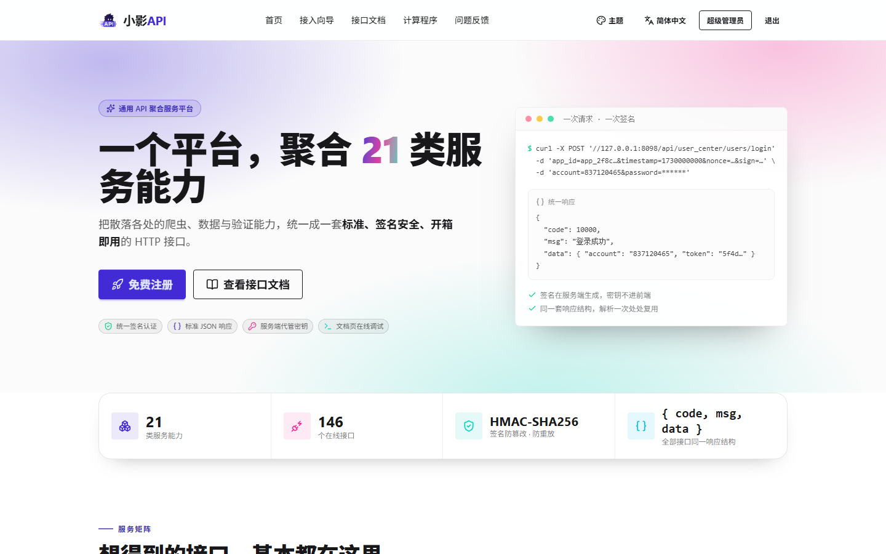
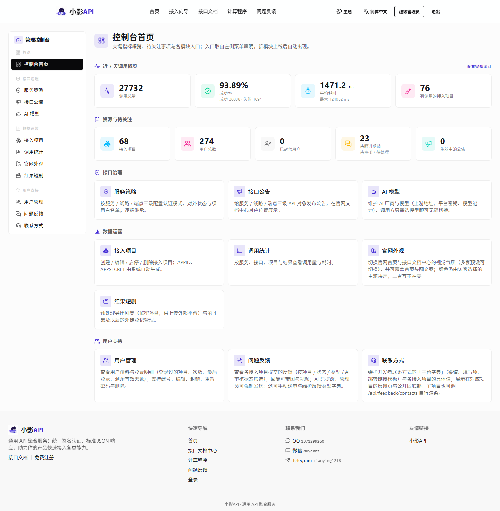
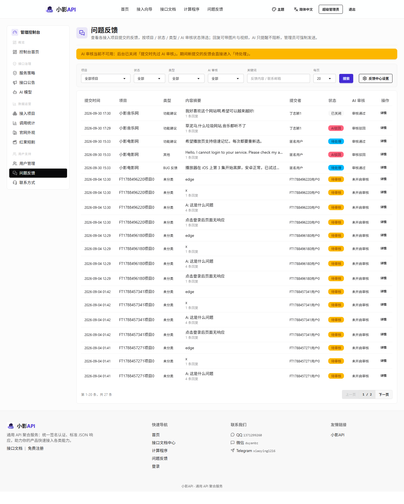
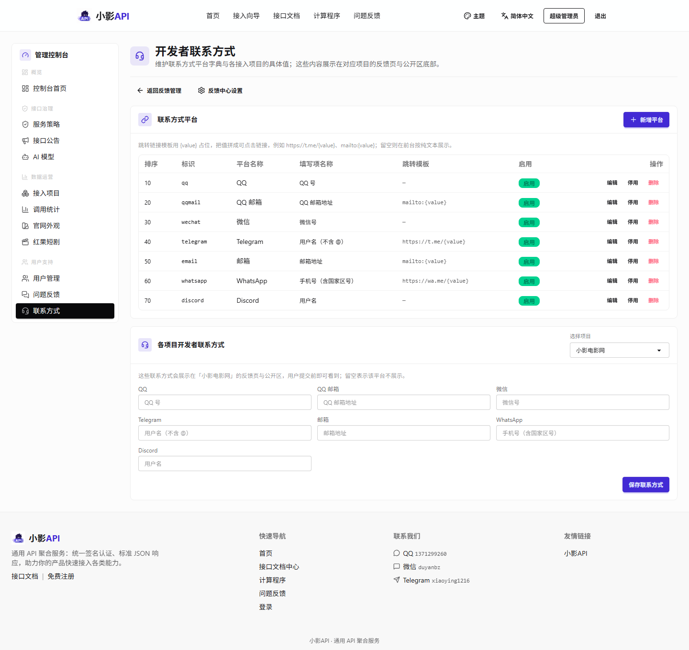
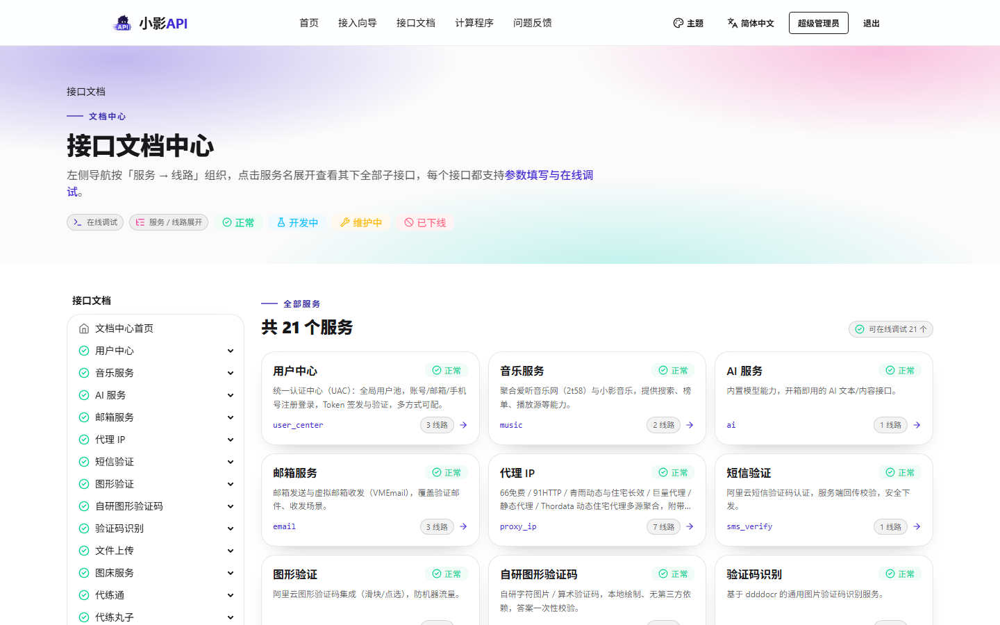
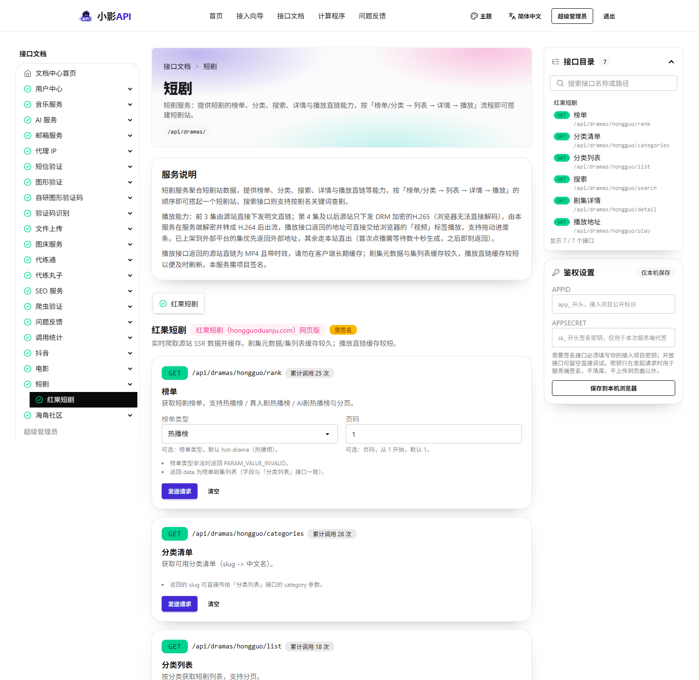
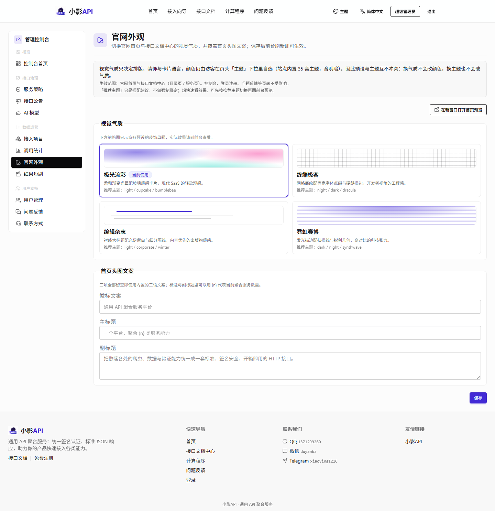

# 小影 API（XiaoYingAPI）

一个致力于构建通用 API 服务的项目，基于 Django 聚合了爬虫、AI、代理 IP、音乐、短视频、SEO、用户中心等多个领域的 API 服务，统一接入签名认证与标准响应格式。



**核心特性**

- **统一的 API 契约**：所有服务共用 `{code, msg, data}` 响应结构与 `API/common/status_code.py` 状态码体系
- **服务策略认证（fail-closed）**：按「服务 → 线路 → 端点」三级配置「需要签名 / 开放 / 跟随上级」，逐级继承；未命中任何策略的服务默认拒绝匿名访问
- **开箱即用的接口文档中心**：声明式描述「服务 → 线路 → 端点 → 参数」，自动生成文档页、侧栏导航与在线调试（服务端代签，浏览器不接触密钥）
- **自带官网前台**：首页、接入向导、统一登录注册、计算程序、问题反馈中心、超级管理员控制台，无需额外后台
- **计算程序库**：目录即数据源，往 `CalculationProgram/` 丢一个带 `README.md` 的目录即自动生成列表页、说明文档与文件下载（见第八章第 6 节）
- **多语言 + 多主题**：简体中文 / 繁體中文 / English；35 款 daisyUI 主题可切换
- **调用统计**：按天预聚合的调用量看板 + 公开查询接口
- **前端零 Node 构建链**：daisyUI 5 + Tailwind 4 由独立可执行文件编译，不需要 npm（**注**：抖音评论线路运行时需要 Node.js，见第三章）

***

## 一、技术栈

| 组件                              | 说明                                                     |
| ------------------------------- | ------------------------------------------------------ |
| Python / Django                 | 后端框架（实测运行版本 Django 6.0.6）                              |
| SQLite                          | 默认数据库（`db.sqlite3`，已配置 20s 写锁等待）                        |
| daisyUI 5 / Tailwind 4          | 官网前端样式（独立可执行文件编译，**前端无 Node 构建链**）                      |
| Django i18n                     | 多语言（简体中文 / 繁体中文 / English），词条见 `locale/`               |
| Node.js                         | **抖音评论线路与海角视频的运行时依赖**（≥ 18，用于本地补环境生成请求签名，见第三章）             |
| ffmpeg                          | **红果短剧网页直出需要**（第 4 集及以后 CENC 解密 + 转 H.264；需在 PATH 上，或由 `HONGGUO_FFMPEG_BIN` 指向可执行文件） |
| 内置 JRE（jlink 裁剪）               | 红果短剧取流签名器（unidbg）的 Java 运行时，约 32 MB，**随代码入库**；因此**无需本机安装 Java** |
| django-cors-headers             | 跨域请求支持                                                 |
| whitenoise                      | 生产模式静态文件服务                                             |
| requests / httpx / lxml         | HTTP 请求与网页解析                                            |
| markdown                        | 把「计算程序」模块的说明文档（README.md）渲染成 HTML（见第八章第 6 节）           |
| pycryptodome                    | 加解密（Crypto）                                             |
| ddddocr                         | 验证码识别                                                  |
| python-dotenv                   | 环境变量加载（`.env`）                                         |
| zhconv                          | 仅构建期：由简体词条生成繁体词条（运行时不依赖）                               |

> 原 `django-simpleui` + `django.contrib.admin` 后台**已整体移除**（访问 `/admin/` 返回 404），管理入口改为官网自带的「超级管理员控制台」（见第七章）。

***

## 二、目录结构

```
XiaoYingAPI/
├── manage.py                     # Django 管理入口（runserver / migrate / collectstatic / createsuperuser）
├── requirements.txt              # Python 依赖清单
├── .env.example                  # 环境变量模板（复制为 .env 后填写，见第五章）
├── XiaoYingAPI/                  # 项目配置：settings / urls（根路由 + 错误页兜底）/ wsgi / asgi
├── API/                          # 主应用：后端业务 + 官网前端（注册于 INSTALLED_APPS）
│   ├── apis/                     # 各业务 API 服务「三件套」，路由汇总在 apis/urls.py
│   ├── common/                   # 公共模块，全站复用，禁止在业务里重复实现
│   ├── models/                   # 数据模型（按业务域分目录，规则见其目录内 数据库模型创建规则.md）
│   ├── website/                  # 官网前台：首页 / 接入向导 / 登录注册 / 文档中心 / 计算程序 / 超管控制台
│   │   ├── docs/                 # 文档中心的「服务 × 线路 × 端点」声明式数据
│   │   └── programs.py           # 「计算程序」模块：扫描内容目录、渲染说明文档（见第八章第 6 节）
│   ├── middlewares/              # 独立中间件组件（cloak_guard 斗篷守卫，见其目录内 README.md）
│   ├── management/commands/      # 自定义管理命令（security_backfill / prune_api_call_hour / cleanup_api_stats / seed_service_policies）
│   ├── migrations/               # 数据库迁移（随代码入库，详见第六章）
│   ├── templates/                # 全站模板，前端规范见其目录内 前端开发必看.md
│   ├── static/                   # 应用内静态文件（前端 CSS/JS 源码与编译产物）
│   └── tests/                    # 单元测试
├── SpiderServices/               # 爬虫源码（被 API 层 utils.py 调用，与业务解耦）
│   ├── Douyin/                   # 抖音：Video/（视频解析）、Comment/（评论发布，含 sign/ 与 js/）
│   └── dramas/hongguo/           # 红果短剧：H5 爬取 + App 取流（app_api / offline）+ 签名服务托管（sign_service）
├── scripts/                      # 辅助脚本：回归测试 / 词条编译与 i18n 体检 / douyin_comment_publish（抖音补环境沙箱）
│   └── hongguo_sign/             # 红果取流签名器运行物：jre/（内置裁剪版 JRE，**仅 Windows**，入库）、sign/ 与 capture/（第三方二进制，不入库，首次部署须手工补齐）
├── CalculationProgram/           # 「计算程序」模块的内容目录（前台 /programs/ 的唯一数据源，见第八章第 6 节）
├── locale/                       # 多语言词条（en / zh_Hant）+ 多语言开发指南.md
├── BugAndRepair/                 # 部署手册 / 事故复盘 / 安全整改报告（索引见其 README.md）
├── media/                        # 媒体文件（用户上传 / 站点 logo）
├── docs/images/                  # 本文档使用的界面截图
├── static/                       # collectstatic 产物（不入库）
└── .trae/                        # Trae AI 技能配置
```

**API 服务的组织方式**：每个服务一个目录，按「三件套」组织——`urls.py`（路由）、`request.py`（参数校验 + 视图）、`utils.py`（爬虫调用封装）；路由统一注册到 `API/apis/urls.py`，公开前缀均为 `/api/`（清单见第三章）。

**`API/common/` 公共模块**（全站复用）：

- `status_code.py`：统一状态码（10000 成功 / 2xxxx 客户端错误 / 3xxxx 业务错误 / 4xxxx 外部错误 / 5xxxx 系统错误）
- `views.py`：全局 JSON 兜底（400 / 404 / 500）+ 服务建设中占位视图
- `middleware.py`：`ApiAuthMiddleware`（服务策略签名认证 + 额度判定，服务/线路/端点三级继承）+ `ApiJsonErrorMiddleware`（`/api/` 的 404 / 405 统一返回 JSON）+ `ApiRequestLogMiddleware`（请求日志 + 调用统计采集）
- `api_stats.py` / `api_stats_query.py`：调用统计的写入（缓冲 + 批量落库）与查询
- `credit_guard.py`：项目额度（点数余额）——调用单价解析（读独立的价格表）、余额判定、按成功调用批量结算点数与扣费、人工充值
- `base.py`：`BaseModel` 基础模型（含 create_time / updated_time 自动字段）
- `sqlite_orm.py`：独立的 SQLite3 ORM 工具库（仅标准库，可单独复用）
- `credential_crypto.py`：凭据对称加密（S-06，`app_secret` / Token 等）
- `security_guard.py`：登录防爆破与签名 nonce 去重（S-03 / S-05）
- `url_safety.py`：公网 URL 校验，拒绝内网 / 回环地址（S-09）

**`API/models/` 数据模型**（按业务域分目录）：

- `Auth/policy.py`：API 服务策略（`ApiServicePolicy`，服务 / 线路 / 端点三级，状态 + 认证模式 + 文档可见性 + 使用范围逐级继承；**不含单价**）
- `Projects/app.py`：接入项目管理（`UserApp`，自动生成 APPID / APPSECRET；含 `owner` 归属与 `balance` 额度余额）
- `Credit/ledger.py`：项目额度充值流水（`AppCreditLedger`，只记人工充值 / 扣回，不记逐次扣费）
- `Credit/price.py`：API 调用单价（`ApiPricePolicy`，服务 / 线路 / 端点三级逐级继承、兜底 `DEFAULT_PRICE`；行存在 = 显式设价）
- `Users/`：用户中心（`User` 主表 + `UserToken` 登录凭证 + `UserVerifyRecord` 验证记录 + `UserLoginLog` 登录日志；`AuthMethod` 认证方式开关）
- `Email/email_template.py`：邮件模板（可自定义验证邮件内容）
- `Feedback/`：问题反馈中心（`feedback.py`：反馈主表 `Feedback` + 类型字典 `FeedbackType` + 回复 `FeedbackReply` + 附件 `FeedbackAttachment` / `FeedbackReplyAttachment` + 审核留痕 `FeedbackAuditLog`；`contact.py`：联系方式平台 `ContactPlatform` + 项目绑定 `ProjectContact`；`setting.py`：全局设置单例 `FeedbackSetting`；`ticket.py`：反馈页一次性票据 `FeedbackTicket`）
- `Music/music.py`：音乐数据模型（`Music` 元数据 + `MusicSource` 播放源）
- `Haijiao/account.py`：海角社区账号库（`HaijiaoAccount`，注册成功的账号自动入库；密码 / token 落库 AES 加密）
- `AI/provider.py`：AI 厂商 / 模型 / 系统提示词（`AiProvider` + `AiModel` + `AiSystemPrompt`，平台 Key 密文落库）
- `Captcha/captcha.py`：自研图形验证码一次性挑战（`CaptchaChallenge`）
- `Docs/announcement.py`：接口公告（`Announcement`，服务 / 线路 / 端点三级）
- `ImageHosting/image_hosting_token.py`：图床服务端 Token 池（`ImageHostingToken`）
- `Statistics/api_call_stat.py`：调用统计（`ApiCallStat` 按天 + `ApiCallStatHour` 按小时，含 `cost_points` 消耗点数）
- `Website/appearance.py`：官网外观单例（`SiteAppearance`：视觉预设 / 首页文案 / 页脚等）
- `Security/`：`setting.py` 安全设置单例（`SecuritySetting`，后台入口隐身等开关）+ `audit.py` 超管操作审计（`ConsoleAuditLog`）
- `Quota/`：服务余量监控——`service.py` 逐项余量（`QuotaService`）+ `setting.py` 通知设置单例（`QuotaSetting`）
- `Monitor/`：上游故障告警——`setting.py` 阈值 / 开关（`UpstreamAlertSetting`）+ `state.py` 告警武装状态（`UpstreamAlertState`）
- 服务对外状态不再单独建表：已并入「服务策略」表的 `status` 字段（见第七章第 3 节）

***

## 三、API 服务清单（API/apis/）

所有服务统一挂在 `/api/` 前缀下，路由注册于 [API/apis/urls.py](API/apis/urls.py)。各服务内部的「三件套」结构不再展开；参数说明与**在线调试**见站内文档中心 `/docs/`（见第八章）。

| 服务      | URL 前缀                      | 说明                           |
| ------- | --------------------------- | ---------------------------- |
| 邮箱服务    | `/api/email/`               | 邮箱 v1（发送邮件）                   |
| 虚拟邮箱(mail.cx) | `/api/VMEmail_mailcx/`      | mail.cx 临时邮箱：随机生成地址收信（仅收信，需签名） |
| 音乐服务    | `/api/music/`               | 爱听音乐网（2t58）、小影音乐             |
| 文件上传    | `/api/upload/`              | 通用文件上传                       |
| 抖音      | `/api/douyin/`              | 抖音视频 / 图文解析 + 评论发布（均需签名）     |
| 电影      | `/api/movies/`              | 影视聚合：分类 / 列表 / 详情 / 选集 / 播放地址（555 电影线路） |
| 短剧      | `/api/dramas/`              | 红果短剧：榜单（4 种）/ 两级分类 / 搜索 / 详情 / 播放地址（第 4 集及以后由本站按需解密 + 转 H.264 直出） |
| 海角社区    | `/api/haijiao/`             | 今日域名（自动跟随源站当日可用域名）、内容列表（热帖 / 新闻 / 大事记 / 原创 / 精华 / 最新）、搜索、帖子详情与评论、发帖（板块 / 标签 / 图片视频）、我的收藏（收藏夹的列表 / 新建 / 重命名 / 删除，收藏帖子 / 取消收藏 / 批量取消收藏）、视频播放列表、图片解码、账号注册 / 登录、金币签到（含一键全签）与账号库管理 |
| AI 服务   | `/api/ai/`                  | 多厂商大模型对话（当前含 DeepSeek）：切模型只改 `model` 一个参数，厂商地址与密钥由超管在后台维护（见第七章第 8 节） |
| 爬虫验证    | `/api/spider_verification/` | 爬虫验证（sv4759）                  |
| 代练通     | `/api/dlt/`                 | 代练订单信息查询                     |
| 代练丸子    | `/api/dlwz/`                | 代练丸子数据                       |
| 验证码识别   | `/api/ddddocr/`             | ddddocr 验证码识别                |
| 验证码识别(超级鹰) | `/api/chaojiying/`          | 超级鹰打码平台：图片识别 / 报错返分 / 查询题分（平台账号统一配置，按题分计费） |
| 代理 IP   | `/api/ProxyIp/`             | 国内动态代理 IP：巨量代理 / 51代理（51代理 的节点只在国内可达，返回里会额外给一个「经国内中转」的 `proxy` 字段，海外也能直接用）  |
| SEO 服务  | `/api/seo/`                 | 友情链接等 SEO 相关                 |
| 问题反馈    | `/api/feedback/`            | 统一问题反馈中心：子项目零代码接入（放链接 / iframe），AI 先审、管理员后台回复；`/api/` 下仅剩免签的 `ticket` 与 `contacts`（见第七章第 9 节） |
| 用户中心    | `/api/user_center/`         | 统一认证中心（项目接入 / 用户注册登录）        |
| 短信验证    | `/api/sms_verify/`          | 短信验证码认证（阿里云）                 |
| 图形验证    | `/api/captcha_auth/`        | 图形验证码集成（阿里云）                 |
| 自研图形验证码 | `/api/captcha_self/`        | 自研字符图片 / 算术验证码（本地绘制，一次性校验）   |
| 调用统计    | `/api/statistics/`          | 公开查询 API 调用量（仅调用次数，免签名）      |

### 抖音服务（唯一需要 Node.js 运行时的服务）

- **评论发布**（`/api/douyin/comment/publish`）：需要 `node`（≥ 18，用到全局 `fetch` 与 Web Crypto）。签名的 `a_bogus` 与 `x-tt-session-dtrait` 均由**本地补环境执行抖音官方 JS** 生成，不依赖浏览器，也不依赖任何外部签名服务。脚本与 chunk 固化在 `SpiderServices/Douyin/Comment/{sign,js}/`（抖音改版后需重新抓取，见第九章第 6 节）。
- **视频解析**（`/api/douyin/video/parse`）：**不需要 Node**，走匿名 ttwid + 重试策略。
- **登录 Cookie 在文档页右侧栏填一次即可**：打开 `/docs/douyin/` 的「评论发布」，右侧栏「本机凭据」卡片粘贴抖音登录 Cookie 并点「保存到本机浏览器」，之后在线调试会自动带上（只存本机 `localStorage`，不上传、不落库；换设备或清缓存需重新粘贴）。
- 评论接口风控严格，请低频调用并对失败做退避；两个接口均需签名（见第七章第 4 节）。

### 短剧服务（红果线路：第 4 集及以后可网页直接播放）

**目录能力（榜单 / 分类）**

- **榜单 4 种**（`rank` 接口的 `type`）：`hot-drama` 热播榜 / `hot-real-drama` 真人剧榜 / `hot-ai-drama` AI剧榜 / `hot-comic-drama` 漫剧榜，均支持 `page` 分页（每页 20 条）。
- **分类是两级的**：一级是内容形态 —— `real-drama` 真人剧 / `comic-drama` 漫剧 / `ai-drama` AI剧 / `comic` 漫画；二级是题材 —— `real-drama/romance` 爱情、`real-drama/period` 年代、`comic-drama/creative` 脑洞 …（共 40 个，漫画无二级）。
- `GET /api/dramas/hongguo/categories` 返回**分类树**（一级节点带 `children`），每个节点的 `slug` 都能直接传给 `list` 接口的 `category`：**一级取该一级全部，二级只取该题材**。
- 取值清单只有一份来源 —— 爬虫 `SpiderServices/dramas/hongguo/utils.py` 的 `CATEGORIES`；视图层白名单（`CATEGORY_VALUES`）与文档页下拉（`CATEGORY_OPTIONS`）都由它派生，站点新增题材时只改这一处。

红果源站 H5 只对每部剧的**前 3 集**下发明文直链（`playable=true`）；第 4 集及以后源站只下发 **DRM 加密的 H.265**（源站 `gear_des_key` 自证：`MP4|encrypt|h265_hvc1`），也没有任何明文 / m3u8 通道——无法靠"换个参数要 H.264"绕过（`video_platform` 只接受 1024）。

**关键约束**：浏览器在多数机器上**完全解不了 HEVC**。实测 Chrome（`canPlayType('hvc1')` 为空、`MediaSource.isTypeSupported('hvc1')` 为 false、`VideoDecoder.isConfigSupported('hvc1')` 也为 false），原生 / MSE / WebCodecs 三条路全断。所以「网页能播」= 视频必须是 **H.264**。

`play` 接口对第 4 集及以后返回 **本站直出** 地址，前端拿到的 `data.url` 可直接交给 `<video>` 播放：

| 来源 | 触发条件 | 说明 |
| --- | --- | --- |
| `data.source=stream` | 第 4 集及以后（唯一路径） | **全自动、免人工**：本站按需解密 + 转 H.264 后出流，对应 `GET /api/dramas/hongguo/stream` |

前三集走源站直链的返回 `data.source=origin`（`data.source` 与 `detail` 的 `episodes[].source` 是同一套取值）。

**`detail` 与 `play` 的口径必须一致**（判断「某集能不能播」只认 `episodes[].playable`，别用 `playable_cnt` 推算）：每集的 `playable` 就是上面两条路的结论 —— 源站直链 / 本站直出任一可用即为 `true`，并用 `episodes[].source` 标出来源。因为本站直出默认可用，**第 4 集及以后的 `playable` 通常也是 `true`**。两个计数各管一段：`playable_cnt` = 源站直链的连续范围（前 N 集，保持原义）、`listed_cnt` = 实际可播集数。

**本站直出的工作方式**：

1. `GET /api/dramas/hongguo/play?series_id=&ep=&q=1080` → `data.source=stream`，`data.url` 是带**时效令牌**（默认 2 小时）的出流地址，`data.ready` 表示该画质是否已生成；
2. `<video src="data.url">` 直接播放；该地址**不需要项目签名**（浏览器加不了签名），鉴权由 URL 里的令牌承担；
3. **出流画质**由 `q` 指定（= 输出宽度上限，短剧是竖屏，`1080` 即 1080×1920）：可选 `1080 / 720 / 540 / 480 / 360`，不传用 `HONGGUO_STREAM_QUALITY`（默认 `1080`，即源站最高档、不缩放）。画质**写在令牌里**，同一个 `series_id` 换了 `q` 要重新调 `play` 换地址；每档产物各存一份，互不影响；
4. 该集该画质**首次**被点播时，`stream` 返回 `202`（`Retry-After: 3`），服务端在后台取流 → CENC 解密 → 转 H.264 → 落盘；前端轮询该地址，**拿到 `200` / `206`（响应体为 `video/*`）才是可播**，生成失败返回 **`503`**（响应体 JSON 里有原因）—— 别只按「有响应」判定（本机 1080p 实测约 25~40 秒/集）；
5. 产物按 `{HONGGUO_STREAM_DIR}/{series_id}/{画质宽度}/001.mp4` 永久复用，此后再播**即刻返回**；支持 **HTTP Range（206）**，可拖动进度条、可断点续传。
6. **「正在生成」怎么判定、坏了怎么自愈**：状态由「产物文件 + 锁文件」表达 —— 产物在即 `ready`；锁文件在（内容是**属主 pid**、mtime 即开工时间）即 `running`，`elapsed` 由文件推算，因此多 worker 看到的一致。属主进程已死（例如**部署重启 uwsgi** 打断转码留下的锁）或锁已超时，会被**下一次点播立刻接管重转**，不会让某集永久卡在「正在生成播放地址」。

> **成本提示**：本站直出的播放流量都经过本站（1080p 约 30~50 MB/集），且每集首次点播要占用一次转码算力（有硬件编码器时优先用 NVENC / QSV / AMF，否则回退 libx264）。
>
> **画质说明**：源站 1080p 本体码率仅约 540 kbps，转码的意义是「别在二次编码时再掉一层」而非「加细节」，因此各档码率上限按档位分别设定（见 `SpiderServices/dramas/hongguo/transcode.py` 的 `_RATE_BY_WIDTH`）。此前默认档是 `HONGGUO_STREAM_HEIGHT=720`（按**高度**缩，竖屏宽度只剩 408px），观感明显发虚，故改为按**宽度**计档、默认 1080。

**网页直出相关配置**（详见 `.env.example`）：`HONGGUO_STREAM_DIR` / `HONGGUO_STREAM_QUALITY`（默认出流画质 = 输出宽度上限，默认 1080）/ `HONGGUO_STREAM_HW_ENCODERS` / `HONGGUO_STREAM_X264_PRESET` / `HONGGUO_STREAM_X264_CRF` / `HONGGUO_STREAM_TOKEN_TTL`（默认 7200 秒）；各画质档的码率上限在 `SpiderServices/dramas/hongguo/transcode.py` 的 `_RATE_BY_WIDTH` 里按档位设定。

> API 文档中心的「播放地址」接口自带**在线播放器**：发送请求成功后会自动加载并播放返回的地址（m3u8 走 hls.js，mp4 直链直接交给 `<video>`），可直接用来验收。

**运行时依赖（仅第 4 集及以后需要）**

| 依赖 | 说明 |
| --- | --- |
| **Java** | 取流签名器基于 unidbg（Java）。仓库内置的 `jre/` 是 **Windows 版**（只有 `java.exe` / `.dll`），Windows 本机开箱可用；**Linux 服务器另装 JDK 17 并设 `HONGGUO_JAVA_BIN=/usr/bin/java`**（该变量优先级高于内置 `jre/`）。转码进程按需自动拉起签名服务并复用（见 `SpiderServices/dramas/hongguo/sign_service.py`） |
| **ffmpeg** | 解密依赖 `ffmpeg -decryption_key`（CENC AES-CTR），网页直出还用它转 H.264。默认取 PATH 上的 `ffmpeg`，可用 `HONGGUO_FFMPEG_BIN` 指定绝对路径 |
| **硬件编码器（可选）** | 装了 NVENC / QSV / AMF 时转码显著更快（实测 QSV 约 25~30 秒/集，软编 libx264 veryfast 约 70 秒/集）；都不可用时自动回退 libx264 |

> 取流签名器的运行物（`unidbg-sign.jar` 与 metasec 原生库）属第三方二进制、**不入库**，按 `scripts/hongguo_sign/start_sign_service.bat` 顶部说明单独获取后放到相同相对路径；**换机器 / 首次部署最容易漏这一步**，症状是「前 3 集能播、点播第 4 集报运行物缺失」。Linux 上线清单见《Django部署上线操作手册》步骤 1。

### 海角社区服务（域名每日变动，自动跟随）

海角的大陆可访问域名**每日变动**，源站用配置接口 `GET {任意海角域名}/api/login/conf` 公布当日可用域名（站点首页弹窗「今日大陆直接访问网址为: xxx」取的就是其中的 `domain`）。

- **自动跟随**：爬虫每次新建实例前会调 `current_base_url()`（`SpiderServices/haijiao/utils.py`），命中缓存零开销，未命中则从任一可达的 conf 入口拿候选并对每个候选做**业务探活**（逐个验证候选域名的验证码端点，成功缓存 30 分钟；探测失败节流 60 秒，失败沿用现有域名）。**为什么必须业务探活**：conf 接口在旧域名上也会返回「成功 + 自指旧域名」（2026-10-02 线上实测：昨日域名 d505… 的 conf 仍 200 且 `domain` 指向自己，只信 conf 会把 BASE_URL 切回业务端点已死的域名）。成功后把选定域名写回共享缓存，多 worker 自动跟上；切换由 `set_base_url()` 完成——`BASE_URL` 与由它派生的全部接口地址常量、请求头里的 `origin` / `referer` 一并改写，代码里写的 `BASE_URL` 只是探测失败时的兜底值。
- **缓存**：探测结果缓存 30 分钟（`HAIJIAO_DOMAIN_CACHE_TTL`，分钟）；全部入口都探测不通时沿用现有域名，并在 60 秒内不再重复探测，接口不会整体不可用。
- **查询接口**：`GET /api/haijiao/domain` 返回 `domain`（今日大陆可直接访问域名）/ `backup_domain`（备用）/ `abroad_domain`（海外永久）/ `movie_domain`（影视站）/ `customer_service`（客服邮箱）——给自建反代 / 书签 / 公告等外部系统用。

**自动注册（超管控制台上 `/console/haijiao/register/`，不提供对外接口）**

服务层是一支流：`API/apis/haijiao/utils.py` 的 `iter_auto_register()` 把「取验证码 → 超级鹰打码 → 提交注册」串起来并**逐帧（而非最后一次性）** yield 进度，控制台页用 `EventSource` 消费、实时刷进度条 / 日志 / 结果表。

- **「更新今日域名」按钮**：页面「运行设置」顶部显示当前域名，点「更新今日域名」即**强制重探**（绕过缓存与失败节流，`refresh_domain_config()`）——对候选域名（conf 声称的今日域名 → 备用 → 海外永久）逐个做**业务探活**，把注册切到第一个真正可用的域名。注册链路用的就是切换后的域名（本 worker 立即生效，其它 worker 经共享缓存自动跟上），无需重启、无需刷新页面。
- **出口四选一**：直连、**51代理**、**巨量代理**、**51代理（经国内中转）**（源站对注册有 IP 限制，被限时换代理出口），默认项由 `HAIJIAO_REGISTER_PROXY` 决定（留空 = 51代理）；取码与提交复用同一出口 IP，每次重试都会重新取一条代理（换出口）。51代理 的代理地址带上账号密码，服务器出口 IP 未加白名单时也能走通。
- **⚠️ 海外服务器必须选「51代理（经国内中转）」**：51代理 的**提取接口**可以通过国内 nginx 反代走通，但**提取出来的代理 IP 本身也只在国内网络可达** —— 海外服务器直连这些 IP 一律 TCP 超时（实测 0/5，同一台机器上巨量 4/5 可用），症状是取码要 62 秒（3 次重试各 20s）后失败。`relay` 出口由国内那台机器去连 51代理 再把数据回传，实测取码 1.5 秒成功。部署见 `scripts/hj_relay/hj_relay.py` 顶部说明。
- **打码**：识别类型**在页面下拉里可选**（选项由超级鹰官方类型表 `CODETYPES` 直接派生，不另抄一份；**默认 1902** = 4~6 位英文数字，下拉项末尾的数字即该类型单价）；服务层默认值见 `OCR_CODETYPE`，非法值会被视图拒绝。用户名 / 密码 / 邮箱由服务端自动生成，注册成功即入库（密码 AES 加密落库）。
- **报错返分**：源站回「验证码错误」（即打码没打对）时自动调超级鹰「报错返分」退回这 15 题分，并换一张新验证码重试；其它失败（网络异常 / 用户名已存在 …）**不返分**——那些情况超级鹰并没有识别错，恶意报错会被平台评估信用。返分失败会退避重试 3 次，并把平台错误码（如 `-1013 错误率太高`）如实写进日志与运行汇总，不会静默吞掉。
- **重试口径**：只有源站给出「非验证码」的业务性拒绝才直接判失败；取码失败、打码平台失败、验证码错误都换一张重来 —— 前两种没花题分、第三种尝试返分，重试的边际成本很低。另外**取验证码图片这一步自身会重试 3 次**：源站边缘偶发把图片地址 302 到备用域名，而该备用域名路由不稳定（会 404），重发同一地址多能正常返回。⚠️ 取图必须与取码走**同一出口**（代理要按请求级传入，不能只挂 session）——两个出口 IP 不一致时源站会按 captchaId 校验并把图片 302 走，这是此前大批 404 的真正原因（见变更记录）。
- **实测**：单次识别命中率约 20%（该验证码为 6 位英文数字 + 密集噪点），所以重试上限直接决定成功率 —— 页面默认 3（约 5 成）、可调到 5（约 6 成半）。
- **识别类型对比（实测，结论：类型不是杠杆）**：`1006`（1~6 位英文数字，官方对 6 位英数的推荐）**18 次命中 4 次 ≈ 20%**；`4006`（纯数字）6 次命中 1 次 ≈ **17%**；`1902`（通用 4~6 位）6 次命中 0 次（样本小）。三者没有量级差异，**默认按站点当前验证码形态选了 `1902`**；页面已开放下拉，可自行换类型对比（换类型只影响单价与识别口径，不解决噪点问题）。
- **⚠️ 源站有「每日单 IP 注册上限」**：打满后源站会直接回 `ip:x.x.x.x今日注册账号数量超过系统限制!`（实测直连出口已打满）。此时**必须改用代理出口**（海外服务器用「51代理（经国内中转）」或「巨量代理」；本地用「51代理」即可）——这正是该选项存在的意义，不是可选项。
- **代理源已换成 51代理**（原用巨量）。⚠️ 更正一个早前的误判：观测到的「代理出口大量 302→404」**不是平台差异**，而是 `register_captcha` 下载图片时漏传请求级代理、导致取码与取图走了两个出口 IP。修好后两个平台取码都恢复正常（实测巨量 5/8、51代理 8/8，失败多为代理自身网络抖动）。
- **跑完可接着再跑**：每次点「开始自动注册」先向 `/console/haijiao/register/ticket/` **现领一张一次性票据**，SSE 首次连接时核销。这样跑完一批接着点就行、**不必刷新页面**；而 `EventSource` 断线自动重连用的仍是那张已核销的旧票据，会被直接拒绝，不会因一次网络抖动重复注册一整批（也顺带挡住连点两次）。票据存**文件缓存**（`caches['haijiao']`），因为默认缓存是 LocMem（只在单进程内有效，uwsgi 多 worker 下会误判失效）。
- **⚠️ 注册过程中别关页面**：进度由本页面通过 SSE 实时接收，页面一断（关窗口 / 关页面 / 刷新 / 长时间切走）这一批就中止了。页面上有醒目提示条。

> **⚠️ 关于返分被拒（`-1013 错误率太高`）**。超级鹰对「报错返分」有信用评估：识别错误率过高时会直接拒绝受理（官方错误码 `-1013`，且**连中文说明都不返回**，故代码里内置了一份官方错误码对照表用于日志）。该拒绝曾连续出现（一度约 8 成的报错退不回题分），但最近实测**连续 6 次报错全部返分成功**，判断是平台侧的**临时信用状态**而非永久限制。若日后再次出现，处理办法仍是**把识别率提上去**。官方口径另有「恶意报错会被评估信用、情节严重将终止合作」的警告，故仍不建议把本页当作主力扩号手段。

> 打码平台侧另有一处修复：上传给超级鹰的图片**文件名与 Content-Type 必须与真实格式一致**（源站验证码是 PNG，此前一律按 `captcha.jpg` / `image/jpeg` 上传，平台解码出错、读数全是乱码）——见 `SpiderServices/Chaojiying/utils.py` 的 `image_upload_part()`。

***

## 四、快速开始（本地运行流程）

```bash
# 1. 创建虚拟环境并安装依赖
python -m venv .venv
# Windows: .venv\Scripts\activate     Linux/Mac: source .venv/bin/activate
pip install -r requirements.txt

# 2. 生成配置文件：复制模板后填写（模板含全部变量与默认值，说明见第五章）
#    Windows: copy .env.example .env      Linux/Mac: cp .env.example .env
#    至少填写 SECRET_KEY；本地开发可保持 ALLOWED_HOSTS=127.0.0.1,localhost

# 3. 数据库迁移（migrations 随代码入库，见第六章；本地改模型后先 makemigrations 再 migrate）
#    迁移会自动把图形验证码 / 调用统计等公开节点写成「服务策略」的开放策略，无需额外命令
python manage.py migrate

# 4. 收集静态文件（前端样式与站点资源依赖，简单场景可跳过）
python manage.py collectstatic --noinput

# 5. 创建超级管理员（首次运行；登录入口是官网 /login/，不是 /admin/）
python manage.py createsuperuser

# 6. 启动服务
python manage.py runserver 0.0.0.0:10000
```

> **Node.js 仅在用到抖音评论接口或海角视频播放时才需要**（`node -v` 确认 ≥ 18）；其余服务不依赖。⚠️ **Linux 服务器默认不带 node**，要靠海角取流或抖音评论就必须自行安装（官方静态包即可，脚本无 npm 依赖），装在非默认位置时用 `.env` 的 `HAIJIAO_NODE_BIN` 指定 —— 少了它的报错长得像权限问题（`[Errno 13] Permission denied: 'node'`），其实是「没装」，详见部署手册第五节第 12 条。
> **红果短剧不需要安装 Java**（取流签名器用项目内置的裁剪版 JRE，随代码入库）；但需要 **ffmpeg** 在 PATH 上（或由 `HONGGUO_FFMPEG_BIN` 指定），第 4 集及以后的网页直出靠它解密与转码。
> 前端样式产物 `API/static/css/output.css` 与多语言词条 `locale/**/*.mo` 均**随代码入库**，拉到代码直接跑即可；只有新增 daisyUI / Tailwind 类名或改动 `.po` 词条时才需本机重新编译（命令见第八章第 4 节）。

启动后：

- 官网首页：`http://127.0.0.1:10000/`
- 接口文档中心：`http://127.0.0.1:10000/docs/`（含签名代调式在线调试）
- 统一登录 / 注册：`http://127.0.0.1:10000/login/`、`http://127.0.0.1:10000/register/`
- 超级管理员：在 `/login/` 用 `createsuperuser` 的账号密码登录，登录后页头出现「超级管理员」入口（`/console/projects/`）
- API 入口：`http://127.0.0.1:10000/api/...`

**上线部署**：线上推荐 uWSGI + Nginx 方式（宝塔面板），完整流程见 `BugAndRepair/` 目录与第九章。

***

## 五、环境变量（.env）

仓库提供模板 [.env.example](.env.example)，复制为 `.env` 后按注释填写（`.env` 本身不入库）。全部变量如下：

| 变量                            | 必填 | 说明                                                                                     |
| ----------------------------- | -- | -------------------------------------------------------------------------------------- |
| `SECRET_KEY`                  | 是  | Django 密钥；**缺失服务拒绝启动**。同时用于 `app_secret` 等凭据的密文派生，上线后**不可再变更**（变更即已加密数据不可解密）               |
| `DEBUG`                       | 否  | `True`/`False`，默认 `False`（生产必须为 False）                                                  |
| `ALLOWED_HOSTS`               | 是  | 允许访问的域名，逗号分隔；**缺省仅允许 `127.0.0.1` / `localhost`**，生产请显式填写真实域名（禁止 `*`，S-08）               |
| `CORS_ORIGIN_ALLOW_ALL`       | 否  | 是否允许所有跨域来源，默认 `False`                                                                    |
| `XYAPI_COOKIE_ISOLATION`      | 否  | **环境模式单一开关**：`true`=本地开发（独立 Cookie 名隔离多项目 + 不强制 HTTPS）；删除或 `false`=生产（标准 Cookie 名 + 强制 HTTPS Cookie）。生产务必不设置或设为 `false` |
| `XYAPI_WEB_APP_NAME`          | 否  | 官网在「接入项目」中的应用名称，默认 `小影API官网`；首次使用自动创建                                                  |
| `XYAPI_PROGRAMS_ROOT`         | 否  | 「计算程序」模块的内容根目录，默认 `CalculationProgram/`；**该目录下的文件会被前台完整对外展示并提供下载**，请勿放入密钥、Cookie 等敏感文件 |
| `QQ_MAIL_ACCOUNT`             | 否  | QQ 邮箱发件账号（邮件服务用）                                                                       |
| `QQ_MAIL_AUTH_CODE`           | 否  | QQ 邮箱 SMTP 授权码                                                                         |
| `EMAIL_VERIFY_MODE`           | 否  | 邮箱验证方式，默认 `both`                                                                        |
| `EMAIL_VERIFY_EXPIRE_MINUTES` | 否  | 邮箱验证码有效期（分钟），默认 `30`                                                                    |
| `PHONE_VERIFY_EXPIRE_MINUTES` | 否  | 短信验证码有效期（分钟），默认 `5`                                                                     |
| `CAPTCHA_SELF_ENABLED`        | 否  | 官网表单是否启用自研图形验证，默认 `true`；设 `false` 可整体跳过                                                |
| `CAPTCHA_SELF_EXPIRE_SECONDS` | 否  | 自研图形验证码有效期（秒），默认 `300`                                                                  |
| `ALIYUN_ACCESS_KEY_ID`        | 否  | 阿里云 AccessKey ID（短信 / 图形验证等用）                                                           |
| `ALIYUN_ACCESS_KEY_SECRET`    | 否  | 阿里云 AccessKey Secret                                                                   |
| `CAPTCHA_APP_ID`              | 否  | 阿里云图形验证 captchaId（仅供 `/api/captcha_auth/aliyun/` 服务）                                  |
| `CAPTCHA_APP_KEY`              | 否  | 阿里云图形验证 appKey（同上）                                                                      |
| `DAILIAN_SIGN_KEY`            | 否  | 代练通接口签名密钥（S-04 起由 `.env` 提供，不再硬编码）                                                       |
| `CHAOJIYING_USER`             | 否  | 超级鹰打码平台账号（`/api/chaojiying/` 服务用，平台账号统一配置，调用方不接触）                                        |
| `CHAOJIYING_PASS`             | 否  | 超级鹰账号密码（请求时以 md5 值 pass2 发送，不传明文）                                                        |
| `CHAOJIYING_SOFT_ID`          | 否  | 超级鹰软件ID（用户中心生成，可为空）                                                                      |
| `CHAOJIYING_SOFT_KEY`         | 否  | 超级鹰软件KEY（与软件ID 成对；配了就启用识别结果 md5 防篡改校验）                                                     |
| `PROXY_JULIANG_TRADE_NO`      | 否  | 巨量代理：业务编号                                                                             |
| `PROXY_JULIANG_KEY`           | 否  | 巨量代理：业务密钥（服务端据此代算官方签名）                                                                |
| `PROXY_JULIANG_USERNAME`      | 否  | 巨量代理：代理认证账号（与 PASSWORD 成对）                                                              |
| `PROXY_JULIANG_PASSWORD`      | 否  | 巨量代理：代理认证密码                                                                           |
| `PROXY_JULIANG_API_BASE`      | 否  | 巨量代理提取接口地址，留空=直连官方；巨量仅向国内 IP 提供提取服务，海外部署需指向国内中转                                         |
| `PROXY_51DAILI_UID`           | 否  | 51代理：账号 ID（与下面四项配套，对应控制台提取链接里的 uid）                                                  |
| `PROXY_51DAILI_ACCESS_NAME`   | 否  | 51代理：账号名                                                                               |
| `PROXY_51DAILI_ACCESS_PASSWORD` | 否 | 51代理：账号密码                                                                              |
| `PROXY_51DAILI_PACKID`        | 否  | 51代理：套餐 ID                                                                              |
| `PROXY_51DAILI_RID`           | 否  | 51代理：提取链接上的标识（可选）                                                                      |
| `PROXY_51DAILI_API_BASE`      | 否  | 51代理提取接口地址，留空=直连官方 `http://bapi.51daili.com`；51代理只向国内 IP 提供提取服务，海外部署需指向国内中转（仅平台侧可配，不下发给调用方）                          |
| `PROXY_RELAY_URL`             | 否  | 「国内中转出口」地址（形如 `http://<国内IP>:17890`），**海角自动注册与代理 IP 服务共用**；留空则控制台 relay 出口与 51代理 的 `proxy` 字段都不可用。部署见 `scripts/hj_relay/`                        |
| `PROXY_RELAY_SECRET`          | 否  | 与中转机 `hj_relay.env` 的 `HJ_RELAY_SECRET` 保持一致（每次请求放在代理用户名里下发）                                  |
| `HAIJIAO_REGISTER_PROXY`      | 否  | 自动注册页「出口」下拉的默认选中项：`direct` / `51daili` / `juliang` / `relay`（留空 = `51daili`；海外生产环境填 `relay`）              |
| `HAIJIAO_NODE_BIN`            | 否  | `node` 可执行文件路径（生成海角视频播放列表要调 `node derive_key.js`）；留空 = 用 PATH 里的 `node`。Linux 服务器装在非默认位置时填绝对路径             |
| `MUSIC_SITE`                  | 否  | 音乐爬虫站点地址，默认 `https://www.aat.cx`（仅调试用）                                                  |

***

## 六、数据库迁移（⚠️ 部署必读）

模型迁移文件位于 `API/migrations/`，**随代码入库（A-05 整改）**。

- **本地**：改模型 → `python manage.py makemigrations API --name <迁移名>` → 提交迁移文件
- **线上**：只执行 `python manage.py migrate`，**严禁**在线上 `makemigrations`（会与代码库迁移集不一致，造成迁移漂移）
- 存量数据回填 / 数据类操作不要写进迁移文件，使用一次性管理命令（如 `security_backfill`）

### 服务策略

服务策略数据（`ApiServicePolicy`）随迁移 `0028_service_policy_v2` 建表，迁移内会幂等地把**公开节点**（图形验证码 `/api/captcha_self/`、`/api/captcha_auth/aliyun/` 与调用统计 `/api/statistics/`）写成 `auth_mode='open'` 的服务级策略，并把历史分类树里显式开放的节点与旧「服务状态」手动数据一并搬过来。

> 后续几条数据迁移又补了同一类「浏览器直连、带不了签名」的例外：`0031_haijiao_video_open` / `0032_haijiao_image_open`（海角社区「视频播放列表」`/api/haijiao/video/m3u8` 与「图片解码」`/api/haijiao/image`，分别供播放器 / `` 直接加载）、`0035_open_hongguo_stream`（红果短剧「网页直出流」`/api/dramas/hongguo/stream`，供 `<video>` 播放）、`0043_feedback_seed`（反馈中心服务本身仍需签名 + 两个供子项目前端直调的开放端点）。

> **注意**：原「重建分类树」命令 `rebuild_category_tree` 与「API 服务分类」分类树已随本次改造整体移除。认证 / 状态改由 `/console/services/` 的「服务策略」（服务 / 线路 / 端点三级逐级继承）管理；未命中任何策略的 `/api/` 路径按 fail-closed 处理（需要签名）。

**本批次新增的其余迁移（`0048`–`0052`，均为纯结构迁移，无数据回填）**

| 迁移 | 内容 |
| --- | --- |
| `0048_quota_service` | 新建 `QuotaService`（逐项余量 / 阈值 / 告警态）与 `QuotaSetting`（通知邮箱单例）——服务余量监控（`/console/quotas/`，见第七章第 10 节） |
| `0049_console_audit_log` | 新建 `ConsoleAuditLog`（超管写操作留痕，含 `-create_time` 索引）——操作日志（`/console/audit/`，见第七章第 12 节） |
| `0050_monitor_upstream_alert` | 新建 `UpstreamAlertSetting`（阈值 / 开关单例）与 `UpstreamAlertState`（按服务的告警武装状态）——上游故障告警（`/console/upstreams/`，见第七章第 11 节） |
| `0051_user_app_owner_quota` | `UserApp` 加 `owner`（归属用户，供前台「我的项目」自助管理）与 `daily_limit` / `monthly_limit`（调用配额） |
| `0052_restrict_sensitive_services` | 数据迁移：把若干敏感服务收敛为「仅白名单」策略（该机制随后已在 `0053` 整体下线，改为额度体系） |

> 其中 `0051` 的 `owner` 保留至今；`daily_limit` / `monthly_limit` 已在 `0053` 随白名单一并删除。

**项目额度（迁移 `0053_credit_ledger_remove_whitelist`）**

原 `app_scope`（项目白名单）已随迁移 `0053` 下线：`ApiServicePolicy` 删 `app_scope` / `apps`、加 `price`（调用单价）；`UserApp` 删 `daily_limit` / `monthly_limit`、加 `balance`（额度余额）；新增充值流水表 `AppCreditLedger`（同时把 #13 建的「XX-仅白名单」策略名去掉后缀，策略本身保留）。授权模型由「白名单二元放行」改为「**额度（点数余额）**」——**新建项目默认 0 点什么都调不了**（开放接口除外），有余额即可调用全部 `/api/` 服务，调用成功（业务码 `10000`）按单价扣点。

> ⚠️ **迁移 `0053` 不给任何既有项目放行**：上线后既有接入项目的余额一律为 `0`，需超管在「项目额度」页 `/console/credits/` 逐个充值，否则全部 `/api/`（开放接口除外）都会返回 `30012 额度不足`。详见 [Django部署上线操作手册.md](BugAndRepair/Django部署上线操作手册.md)。

**调用单价独立成表（迁移 `0054_credit_price_and_cost_points`）**

单价从服务策略里**拆出来**：`ApiServicePolicy.price` 删除，新建 `ApiPricePolicy`（`api_price_policy`，服务 / 线路 / 端点三级、行存在 = 显式设价），控制台新增「线路价格」页 `/console/prices/`；同时给两张调用统计表加 `cost_points`（消耗点数）字段。迁移内会把旧的 `ApiServicePolicy.price` 非空值按同一前缀与层级原样搬进新表（避免升级丢配置），再删旧字段 —— 旧值本来就是 `null`（未配价）时无任何影响。

**建议策略清单（策略表为空 / 换环境时一键补齐）**

上面这些例外原本只存在于**数据迁移**里，而数据迁移一旦标记为已执行就不会重跑 —— 策略表被清空、或换环境重建时，缺失的例外不会自己回来，验证码 / 图片 / 播放地址会整片返回 20011。因此把「策略表该有的最小例外集合」收敛成一份**代码内清单** `API/website/service_presets.py`（路径前缀 / 名称 / 层级 / 认证模式 / 状态 / 为什么需要），两处共用同一份清单与同一套语义：

```bash
python manage.py seed_service_policies --dry-run   # 只列出将新建的条目，不写库
python manage.py seed_service_policies             # 实际补齐（幂等，可反复执行）
```

- 后台亦可一键补齐：`/console/services/` 工具条 →「**一键新建建议策略**」，**先弹出预览面板逐条标注「将新建 / 已存在」，确认后执行**。
- 语义是「**只新建缺失的**」：已存在的一律跳过，绝不覆盖你在后台的自定义配置，因此可反复执行。
- 增删改建议条目就改 `API/website/service_presets.py`（含每条的中文「为什么需要」，见该文件注释）。
- 作为双保险，`/api/dramas/hongguo/stream` 另列在 `ApiAuthMiddleware.PUBLIC_PATHS`（**代码内**免签名单，与 DB 解耦）：即使策略表为空也能访问，鉴权由 `play` 下发的时效令牌承担。

### AI 厂商与模型（无需额外命令）

AI 的厂商与模型注册表（`ai_provider` / `ai_model`）随迁移 `0037_ai_provider_model` 建表；紧接着的数据迁移 `0038_seed_ai_deepseek` 会**幂等地**把旧 `.env` 的 `DEEPSEEK_API_KEY` / `DEEPSEEK_API_URL` 搬进厂商表（该厂商已存在则不改动、Key 已存在则保留）并种下 DeepSeek 的模型记录；迁移 `0039_ai_prompt_and_sampling` 新建系统提示词表（`ai_system_prompt`）并给模型补上「提示词三态选择 / 采样温度 / 最大回复长度 / 停止词」字段，**默认「跟随全局共享」+ 采样参数留空**，因此升级后行为与升级前完全一致。升级只需 `python manage.py migrate`，**不需要手工执行任何管理命令**，也不会出现「迁移完到后台填 Key 之前接口不可用」的空窗；之后新增厂商 / 模型 / 提示词全部在 `/console/ai/models/` 完成（见第七章第 8 节）。

### 小时统计清理（建议配每日计划任务）

调用统计的小时粒度数据（`api_call_stat_hour`）只保留最近 90 天，超期行需定期删除，否则表会无限增长（按天表是全历史真值表，不受影响）：

```bash
python manage.py prune_api_call_hour              # 按默认 90 天保留期清理
python manage.py prune_api_call_hour --days 30    # 临时指定保留天数
python manage.py prune_api_call_hour --dry-run    # 只统计将删除的行数
```

### 调用统计历史残留清理（一次性 / 按需）

统计口径升级后（路径统一取路由模板、删项目同步清统计），历史上按原始 URL 记录的行、以及已删除项目的残影行需要单独清理，见第 6 节：

```bash
python manage.py cleanup_api_stats                  # 归并路径 + 清项目残影（幂等）
python manage.py cleanup_api_stats --dry-run        # 只统计将影响的行数
python manage.py cleanup_api_stats --no-drop-orphan-apps  # 只归并路径，不动项目残影
```

***

## 七、管理入口与认证

> ⚠️ 本项目**没有 `/admin/` 后台**——`django.contrib.admin` 与 `django-simpleui` 已整体移除（访问 `/admin/` 返回 404）。管理入口是官网自带的「超级管理员控制台」。

控制台左侧菜单按「管什么」分五组（声明与口径见 `API/website/console_menu.py`，新增模块只改那一处）：

| 分组 | 管的对象 | 模块 |
| --- | --- | --- |
| 概览 | 控制台自身 | 控制台首页（指标 + 待关注 + 各模块入口） |
| 安全 | 控制台自身的防护 | 安全设置（后台入口隐身）、操作日志（写操作审计留痕） |
| 接口治理 | 对外提供的 API 本身 | 服务策略、线路价格、接口公告、AI 模型 |
| 数据运营 | 接入方 / 流量 / 站点与内容 | 接入项目、项目额度、调用统计、服务余量、上游故障告警、官网外观、海角自动注册 |
| 用户支持 | 用户体系与用户声音 | 用户管理、问题反馈、联系方式 |

视觉上控制台自成一套「工作台」骨架（`API/static/css/input.css` 的 `con-*` 层：统一面板 / 工具条 / 表格容器 / 空态 / 指标块），与官网首页、文档中心那套 `feel-*` 视觉气质互不影响：超管换官网气质不会动到后台。

**后台入口隐身**（`SecuritySetting.hide_console`，默认开启，可在 `/console/security/` 关闭）：开启后，未登录 / 非超管访问 `/console/**` **一律返回 404**，响应体与访问一个根本不存在的地址完全同构 —— 探测者无法据此判断后台入口是否存在（关闭则退回「302 跳登录页」的行为，等于把入口暴露出去）。代价是超管本人也要**先从 `/login/` 登录**再访问后台（登录成功后首页有「超级管理员」入口）；登录页本身仍然公开（任何站点都有登录页），本开关不隐藏登录页。

**控制台首页**（近 N 天调用概览 + 资源与待关注 + 按分组排列的模块入口）



### 1. 超级管理员与接入项目

成为超管：`python manage.py createsuperuser`（判定依据是 Django 的 `is_superuser`）。打开 `/login/` 用「账号 + 密码」登录：是超管则建立超管会话并回跳首页，页头随即出现「超级管理员」入口；不是超管则走普通用户中心登录。

进入 `/console/projects/`（服务端二次鉴权）可新建 / 编辑 / 启停 / 删除接入项目，并支持按名称或 APPID 搜索。新建后系统自动生成：

- `app_id`：公开标识（`app_` 前缀，32 字符）
- `app_secret`：签名密钥（`sk_` 前缀，63 字符，**仅展示一次，需妥善保存**）

创建后 APPID / APPSECRET 固定不可修改；删除项目会使其全部 Token 立即失效。

> 备注：`API/admin.py` 是后台下线前的遗留文件，已无入口引用（死代码），保留仅作参考。

### 2. 用户管理（超管控制台 `/console/users/`）

超管可对用户中心（UAC 全局用户池）的用户做完整管理：

- **列表**：搜索（账号 / 用户名 / 邮箱 / 手机号）+ 筛选（状态 / 注册方式 / 登录过的项目）+ 分页（20 / 50 / 100）；每行显示登录项目数、累计登录次数、最后登录时间
- **详情**（`/console/users/<用户ID>/`）：基本资料、注册信息（注册方式与来源项目）、**按项目登录明细**（登录次数 / 密码登录 / 验证码登录 / 首次与最后登录 / 最后活跃 / 当前有效登录 / 登录态剩余天数）、最近登录记录（含 IP 与客户端）、Token 明细（签发 / 过期 / 剩余 / 状态）、验证记录时间线
- **写操作**：新建用户（邮箱或手机号 + 密码，凭证直接标记为已验证）、编辑资料（用户名 / 邮箱 / 手机号，换绑后重置为「未验证」）、封禁 / 解封、重置密码（按既有业务规则作废该用户全部项目 Token）、删除（需手工输入账号二次确认，级联删除 Token / 验证记录 / 登录日志）

**口径与边界**（页面上也有说明）：

- 用户是**全局用户池**，不属于任何项目；「在哪个项目」只由登录记录得出
- **累计登录次数 = 登录日志（`user_login_log`）条数**：每次登录成功写一条，退出登录与重置密码都**不会**减少；「当前有效登录」才是未过期 Token（登录态）数量
- 登录日志与「验证记录的项目来源」字段**自本次升级起开始记录**，升级之前的历史登录/注册无法回填
- 「在哪个项目注册的」由 `UserVerifyRecord.app` 提供；历史注册记录该字段为空，页面会标注「含历史记录」
- 用户在项目维度的信息以**登录**为准：注册后从未登录过任何项目的用户，项目维度是空白

> 说明：本页只操作**用户中心的用户**（`API/models/Users/user.py` 的 `User`）与控制台超管账号（Django `auth.User`）是两套表，页面上**不提供**把 UAC 用户提升为超管的能力（超管仍由 `createsuperuser` 创建）。

### 3. API 服务策略（服务 / 线路 / 端点三级继承）

服务的认证模式、对外状态、文档可见性与使用范围由「服务策略」（`ApiServicePolicy`，入口 `/console/services/`）管理；**调用单价由独立的「线路价格」页**（`ApiPricePolicy`，入口 `/console/prices/`）管理，两者解耦。策略按**真实 Django 路由**划分为三级粒度：

| 层级            | `path_prefix` 形如             | 说明             |
| ------------- | --------------------------- | -------------- |
| `服务`（service） | `/api/movies/`              | 覆盖整个服务         |
| `线路`（channel） | `/api/movies/movie_555/`    | 覆盖服务下的一条线路     |
| `端点`（endpoint）| `/api/movies/movie_555/list` | 精确到单个接口路径      |

**一条策略可覆盖同一服务下的多条线路**：新建 / 编辑时线路下拉支持多选（按住 Ctrl / Cmd），第一条作主前缀（`path_prefix`）、其余存 `extra_prefixes`，二者合起来由 `all_prefixes` 给出，多线路全部按同一条策略生效。线路多选时端点下拉自动禁用（端点只能归属一条线路）。选中的线路若已被别的策略占用，则**原策略让位**：原策略的前缀全被接管就删除该策略，只被接管一部分则保留剩余线路；页面会提示「原策略已让位」。

每级的配置项都可单独设「跟随上级」（inherit），未设置则向上一级取；最终兜底为 **正常 + 需要签名 + 文档展示 + 正常**：

| 配置项        | 取值                                                | 兜底        |
| ---------- | ------------------------------------------------- | --------- |
| `status`   | `跟随上级` / `正常` / `开发中` / `维护中` / `已下线`（normal/dev/maintenance/offline） | `正常`（normal） |
| `auth_mode`| `跟随上级` / `需要签名` / `开放`（inherit/auth/open）          | `需要签名`（auth，fail-closed） |
| `docs_visible`| `跟随上级` / `文档展示` / `文档隐藏`（inherit/visible/hidden）    | `文档展示`（visible） |
| `audience` | `跟随上级` / `正常` / `仅专属管理员`（inherit/normal/admin_only）  | `正常`（normal） |

**生效顺序**（认证判定的唯一口径是 `API/common/middleware.py` 的 `resolve_service_policy()` / `requires_auth()`）：请求路径命中**全部**策略 → 按 `path_prefix` 长度降序（最具体在前）→ 逐字段取第一个非 `inherit` 的值 → 都没命中就用全局兜底。**未命中任何策略的 `/api/` 路径一律需要签名**。

**状态拦截与额度**（状态拦截最优先，先于签名校验；口径是**只有「正常」可调用**）：
- 生效状态为「开发中」（dev）→ `30006`（服务开发中）；「维护中」（maintenance）→ `30004`；「已下线」（offline）→ `30005`。
- 三种非正常状态都是**命中即拦截、且不做签名校验**（匿名请求同样收到），各自一个业务码便于调用方分辨。想让某个接口可调用，把它的**生效状态**配成「正常」。
- **额度是接口调用的唯一门槛**：签名通过后校验调用项目的**余额**是否够本次的生效单价，不足返回 `30012`「额度不足」。新建项目默认 **0 点** → 什么都调不了（`开放` 模式不校验签名、无调用项目，额度对其无意义）。有余额即可调用全部 `/api/` 服务；充值目前只能超管在「项目额度」页手动操作（暂无支付）。
- 调用**成功**（业务码 `10000`）才按单价扣点，失败不扣；扣费跟随调用统计**批量落库**，因此余额显示比真实用量滞后几秒，且**允许为负**（欠费，下次充值自动抵扣）。判定与扣费口径见 `API/common/credit_guard.py`。

**文档可见性（`docs_visible`）与使用范围（`audience`）**（供后台内部接口使用）：
- 生效 `docs_visible=hidden` 的路径**不出现**在官网文档中心与在线调试中：`/docs/` 服务目录、左侧菜单、`/docs/<slug>/` 端点列表都会过滤掉它（服务级隐藏时该服务文档页直接 404），`/docs/_call/` 在线调试也会拒绝（该页是公开的，隐藏的接口不得可调试）。
- 生效 `audience=admin_only` 的路径仅供后台内部使用：命中该路径的 `/api/` 请求**一律返回 `20020`**（无权限），**不区分是否带签名**，拦截位置在状态拦截之后、签名校验之前。
- 判定口径同样只有一处：`middleware.is_docs_hidden()` / `middleware.is_admin_only()`。

**可视化配置**：超管进入 `/console/services/`，用「服务 → 线路（可多选）→ 端点」三级联动下拉自动推导层级与 URL 前缀（数据源为真实 Django 路由，无需手输），同时展示每条策略的**真实生效结果**（复用中间件判定），保存后立即生效、无需重启。新建 / 编辑弹窗按「作用范围 / 对外表现」两块分区，「对外表现」里可填**调用单价（点 / 次）**（留空 = 跟随上级）；列表支持勾选多条**批量删除**。

**建议策略一键补齐**：策略表是鉴权的唯一来源、全局兜底又是 fail-closed，而「浏览器直连、带不了签名」的那些例外（验证码 / 海角图片与 m3u8 / 红果直出流 / 反馈中心子项目端点）原本只写在数据迁移里，迁移标记已执行后不会再跑，策略表被清空或换环境重建时不会自己回来。工具条上的「**一键新建建议策略**」按代码内清单 `API/website/service_presets.py` 补齐**缺失**的条目：**先弹出预览面板逐条标注「将新建 / 已存在」，确认后执行；已存在的一律跳过，不覆盖自定义配置**，可反复执行。等价命令 `python manage.py seed_service_policies [--dry-run]`（详见第六章）。另有一条**与 DB 解耦**的代码内免签名单 `ApiAuthMiddleware.PUBLIC_PATHS`（GET / HEAD），`/api/dramas/hongguo/stream` 在其中。

**缓存**：策略表查询走进程内 TTL 缓存（`settings.API_SERVICE_POLICY_CACHE_TTL`，默认 60s），后台保存 / 删除策略或改动单价后由信号立即失效，改动即时生效、无需等 TTL、无需重启。

**可直接运行的 curl 示例**（维护态 / 额度不足的返回）：

```bash
# 1) 未命中任何策略的服务（fail-closed）：缺少签名 → 20011
curl -s "https://<你的域名>/api/not_configured/demo"
# {"code": 20011, "msg": "签名参数缺失: app_id / timestamp / nonce / sign 必须同时提供", "data": null}

# 2) 命中「维护中」的服务：无论是否带签名都返回 30004（不做签名校验）
curl -s -X POST "https://<你的域名>/api/movies/movie_555/search" -d "keyword=测试"
# {"code": 30004, "msg": "服务维护中", "data": null}

# 3) 命中「已下线」的服务：同样不做签名校验，返回 30005
#   （下面以 /api/email/ 为例，前提是超管已在「服务策略」把它置为「已下线」）
curl -s -X POST "https://<你的域名>/api/email/v1/send" -d "subject=t&body=t&recipients=a@example.com"
# {"code": 30005, "msg": "服务已下线", "data": null}

# 4) 签名正确但项目余额不够本次单价：返回 30012（去「项目额度」页充值后即恢复）
curl -s -X POST "https://<你的域名>/api/ai/BuiltInModel/chat" \
  -d "content=你好&app_id=app_xxx&timestamp=1700000000&nonce=abc123&sign=<HMAC-SHA256>"
# {"code": 30012, "msg": "额度不足：本次调用需 1 点，当前余额 0 点，请联系管理员充值", "data": null}

# 5) 生效 audience=admin_only 的接口：对外一律 20020（带不带签名都一样）
curl -s "https://<你的域名>/api/xxx/internal_yyy"
# {"code": 20020, "msg": "该接口仅限后台内部使用，不对外开放", "data": null}
```

> 签名算法见本章第 5 节；上面第 4 条的 `sign` 需要用你的 `app_secret` 按同一算法算出。

### 3.1 线路价格（服务 / 线路 / 端点三级单价）

调用单价由**独立的 `ApiPricePolicy`**（入口 `/console/prices/`，控制台「线路价格」页）管理，**与服务策略解耦**——服务策略只管「能不能调」，价格只管「调一次扣多少点」。

- **页面形态**：把服务树（真实 Django 路由，见 `API/website/service_tree.py`）**全量列出**为可折叠的三级结构，每个节点一个价格输入框 —— 留空 = 跟随上级，填了就在该节点建一条单价；填 `0` = 该节点免费。一次提交**批量保存整页**（字段名 `price::<前缀>`），保存立即生效、无需重启。
- **三级继承**：端点级 → 线路级 → 服务级，都没配置则兜底 `DEFAULT_PRICE`（`1` 点/次）。命中最长前缀的行胜出（与鉴权用的前缀匹配同一套判定，见 `middleware.prefix_match`）。
- **行存在 = 显式设价**：表只存「配了价的节点」，清空输入框即删除该行、恢复跟随上级；因此 `price` 字段不允许为空。
- **缓存**：价格表查询走进程内 TTL 缓存（同 `API_SERVICE_POLICY_CACHE_TTL`），后台保存 / 删除单价后由 `API/apps.py` 的信号立即失效。
- **解析口径**：`API/common/credit_guard.py` 的 `resolve_price()` / `resolve_price_detail()`（后者附带来源：`endpoint` / `channel` / `service` / `default`）。

**文档中心标价**：每个端点的头部会显示「生效单价 + 来源」（免费显示「免费」，来源标注端点价 / 线路价 / 服务价 / 默认价），口径与真实扣费完全一致。

### 4. 服务对外状态（超管）

服务对外状态（`正常` / `开发中` / `维护中` / `已下线`）即上文「服务策略」的 `status` 字段，在 `/console/services/` 中按服务 / 线路 / 端点三级设置、逐级继承。它会同步体现在官网首页服务卡片、文档中心目录与左侧导航。未显式设置时按「已接入文档 → 正常，未接入 → 开发中」自动派生（唯一口径见 `API/website/service_status.py`）。

状态在菜单与徽标中都以**图标 + 语义色**呈现（正常 `circle-check` 绿 / 开发中 `flask-conical` 蓝 / 维护中 `wrench` 黄 / 已下线 `ban` 红），无需点进去即可辨认；图标名与配色统一由 `service_status.STATUS_DEFS` 定义，新增状态或换图标只改这一处，模板不得写死。

状态分两级展示，且都走中间件口径（`resolve_service_policy`，服务 → 线路 → 端点逐级继承），因此**展示与真实拦截结果永远一致**：

- **服务行**（左侧导航每项、首页 / 文档中心服务卡片）：只反映**服务级**策略；未显式设置时按「已接入文档 → 正常，未接入 → 开发中」派生。父级不会因为下属某条线路异常而改变。
- **线路行**（左侧导航展开后的子项、文档页顶部线路 Tab）：取该线路下**全部端点生效状态里最严重的一个**，因此端点级策略（只把某个接口设为下线）也会体现在菜单里；`开发中` / `已下线` 的线路与服务级一致**不可点击**，只作占位提示。

### 5. 签名认证契约（需要认证的接口）

调用「需要认证」的接口必须携带 4 个参数：

- `app_id`：项目 APPID
- `timestamp`：10 位时间戳（校验 ±5 分钟窗口，防重放）
- `nonce`：每次请求唯一的随机字符串
- `sign`：HMAC-SHA256 签名

签名算法：除 `sign` 外所有参数按键名 ASCII 升序拼为 `k=v&k=v...`，以 `app_secret` 为密钥做 HMAC-SHA256，输出小写 hex。参考实现见 [API/apis/user_center/sign.py](API/apis/user_center/sign.py) 的 `build_sign` / `verify_sign`。

### 6. API 调用统计

调用量由请求日志中间件顺带采集（`API/common/api_stats.py`），**两级预聚合**入库（都不保存调用明细）：

| 表（模型） | 粒度 | 聚合键 | 保留期 |
| --- | --- | --- | --- |
| `api_call_stat`（`ApiCallStat`） | 按天 | 日期 + 端点 + 项目 + 状态码 | **全历史**（真值表） |
| `api_call_stat_hour`（`ApiCallStatHour`） | 按天 + 小时 | 上述 + 小时 | 近 **90 天**（`HOUR_RETENTION_DAYS`） |

- **写入**：进程内缓冲同时累加两个粒度，满 200 个聚合键或每 5 秒批量落库（多进程各自缓冲，靠累加更新汇合）；统计失败只记日志、不影响业务请求。两者同一批落库、口径一致，因此保留期内「按小时汇总」恒等于「按天合计」
- **口径**：仅 `/api/` 请求；**认证被拒（20011）也会计入**（排障有价值）；统计服务自身不计入；路径取「路由模板」并归一参数（`<uuid>` → `<param>`），避免带 ID 的接口拆成大量行
- **消耗点数（`cost_points`）**：批量落库那一刻按**当时的生效单价**给成功调用（业务码 `10000`）结算出点数写进统计行，并按项目原子扣减余额；**失败调用记 0 点、不扣费**。因为是「按当时单价结算」，**改价不回填历史**，累计消耗永远可对账（单价见 [线路价格](#31-线路价格服务--线路--端点三级单价)）
- **不存在的路径归并**：解析不到真实路由的请求（扫描器探测 `/api/phpinfo.php`、`/api/.git-credentials` 之类）统一归并成 **`/api/_unmatched_/`** 一条，服务榜 / 接口榜显示为「未匹配路径（疑似扫描）」；否则每天的扫描流量会把两个排行榜打散成几十条无意义行（具体被探测的路径仍可在 nginx 访问日志与 `logs/app.log` 查到）
- **项目标签**：统计表按 APPID 聚合且**只追加**。在 `/console/projects/` 删除接入项目时会**同步清掉该项目的统计行**（`purge_app()`）；若仍有查不到项目名的历史 APPID，看板里显示为「**已删除项目**」（筛选下拉会补上 APPID 以免多个已删除项同名），不再显示成裸 APPID
- **历史残留清理**：`python manage.py cleanup_api_stats`（幂等）把历史上按原始 URL 记录的行折算归并到「路由模板」或 `/api/_unmatched_/`，并清掉 APPID 已不存在的统计残影（`--dry-run` 只统计影响面、`--no-drop-orphan-apps` 跳过残影清理）
- **超管看板**：`/console/stats/`（7 / 30 / 90 天可切，可按服务 / 项目筛选），含调用量趋势（成功/失败堆叠）、指标卡（含**消耗点数**与平均每次）与环比、**时段分布（0-23）与峰值时点**、**星期×小时热力图**、**服务×时段矩阵**、服务 / 接口 / 项目排行（项目排行带**消耗点数**与**平均每次**列）、失败最多接口榜、状态码分布、调用量最高的日期；失败率 ≥5% 标黄、≥20% 标红（样本满 20 次才判定，仅页面提示不告警）；图表用本地托管的 Chart.js
- **详情页**：`/console/stats/service/<服务前缀>/`（单服务的接口排行 + 调用它的项目）、`/console/stats/app/<APPID>/`（单项目的服务 / 接口排行，页首另有**「额度与消耗」全历史卡片**：当前余额 / 累计充值 / 累计消耗点数 / 平均每次消耗 / 累计调用，并给出「去充值」入口）
- **小时数据保留**：小时表只为时段类分析服务，超过 90 天必须清理（按天真值表不受影响）：`python manage.py prune_api_call_hour`（幂等；`--days N` 临时改保留期、`--dry-run` 只统计不删）；建议配每日计划任务
- **公开展示**：文档中心每个接口卡片显示「累计调用 N 次」与**生效单价 + 来源**（未登录可见）；亦可调开放接口 `/api/statistics/api_calls?path=<接口路径>` 与 `/api/statistics/services`。公开口径**只含调用次数**，不含项目、失败率与耗时

***

### 7. 接口公告（服务 / 线路 / 端点三级公告栏）

运营在超管控制台 `/console/announcements/` 发布公告，挂到**服务 / 线路 / 端点**三级 API 对象上（表 `docs_announcement`，模型 `API/models/Docs/announcement.py`），在官网文档中心对应位置展示。

| 挂载层级 | `path_prefix` 示例 | 前台展示位置 |
| --- | --- | --- |
| 服务 | `/api/dramas/` | 服务文档页顶部（页面标题之后） |
| 线路 | `/api/dramas/hongguo/` | 该线路 Tab 内容顶部（端点卡片之前） |
| 端点 | `/api/dramas/hongguo/play` | 该接口卡片内（接口名之后） |

- **路径口径与服务策略完全一致**：后台用「服务 → 线路 → 端点」三级联动下拉（数据源 `API/website/service_tree.py` 的真实 Django 路由）自动推导 `scope` 与 `path_prefix`，不手输；渲染前由 `API/website/service_tree.py` 的 `normalize_endpoint_path()` 与端点声明路径对齐
- **一条线路 / 端点可挂多条**：按 `sort`（数字小在前）依次平铺
- **控制项齐全**：级别（信息 / 成功 / 提醒 / 警告）、生效时间段（`start_time` / `end_time`，两端可空）、启停（`enabled`）、排序（`sort`）。级别的文案与图标集中在模型的 `LEVEL_DEFS`，模板不写死
- **生效判定**：`enabled=True` 且落在生效时间段内才展示；未到开始时间或已过结束时间的公告只在后台可见，前台不展示（`Announcement.visible_queryset()` 在数据库侧过滤）
- **不翻译**：公告是数据库动态内容，后台填什么语言就原样显示什么语言，三语访客看到同一份原文（与文档正文的三语翻译机制互不影响）；正文保留换行
- **视觉**：卡片样式集中在 `API/static/css/input.css` 的 `.announce` 组件。配色**全部取自 daisyUI 主题变量**（`--color-info` / `--color-success` / `--color-warning` / `--color-error` 与 `--color-base-100` / `--color-base-content`，用 `color-mix` 调出浅底与同色系描边），切换任意主题（含深色）自动跟随、不写死色值；级别用「左侧 3px 色条 + 实心圆盘图标」区分，正文文字保持 `base-content` 以保证对比度
- **交互**（渐进增强，脚本 `API/static/js/site/docs_announcements.js`，仅当页面确实渲染出公告时加载）：
  - 正文超过 4 行时自动收起并显示「展开全部 / 收起」（是否溢出用 `scrollHeight` 实测，不靠字数猜；窗口尺寸变化后重新判定，用户手动展开过的不回收）
  - 单条公告可点右侧 ✕ 关闭，记入本机 `localStorage`（键 `xyapi:announcement:closed`，按公告 ID），下次访问不再提示；仅影响本机浏览器，不改后台数据
  - 脚本未加载时控件不显示、正文完整可读（无 JS 也能正常浏览）
- **渲染**：`API/website/docs_views.py` 的 `_attach_announcements()` 把公告按三级挂到文档对象上，模板片段 `API/templates/docs/_announcements.html` 三级共用

### 8. AI 服务（多厂商模型，超管维护）

对外只有两个端点，**换模型只改 `model` 一个参数**：接口地址、鉴权方式与响应结构完全不变。

| 端点 | 说明 |
| --- | --- |
| `POST /api/ai/BuiltInModel/chat` | 统一入口：单轮（`content`）/ 多轮（`messages`）、系统提示词覆盖（`system_prompt`）、图片理解、流式输出 |
| `GET /api/ai/BuiltInModel/models` | 模型清单：供调用方动态发现可选模型（只返回模型标识 / 展示名 / 是否支持视觉 / 是否默认，不含厂商、上游地址与密钥） |

- **为什么拆三张表**：`ai_provider`（厂商：上游根地址、平台密钥）、`ai_model`（模型：对外标识、上游模型名、能力、上下架、默认、提示词选择、采样参数）与 `ai_system_prompt`（系统提示词库）。DeepSeek / 月之暗面 / 火山方舟 / 阿里云百炼等都提供 **OpenAI 兼容**的 `/chat/completions`，请求体、响应体与 SSE 分片格式一致，因此只需一套客户端，靠「上游地址 + 密钥 + 上游模型名」区分厂商 —— **接新厂商 = 后台加一条厂商记录（再补模型记录），无需改代码、不用重启**
- **字段口径**：
  - `ai_provider.base_url` 填到**版本段为止**（如 `https://api.deepseek.com` 或 `https://api.moonshot.cn/v1`），服务端在其后拼 `/chat/completions`
  - `ai_model.key` 即请求参数 `model` 的取值（对外唯一标识）；`upstream_name` 用于对外的 key 与上游模型名不一致时填，留空则两者相同
  - `ai_model.supports_vision`（**勾选式**）：决定该模型能否带 `images` 参数；未勾选时传图片返回参数值非法（20003），避免参数被静默丢弃
  - `ai_model.max_images`：单次请求可携带的图片张数上限（默认 2），**仅对勾了「支持视觉」的模型生效**，超限返回参数值非法（20003）
  - `ai_model.is_default`：请求不传 `model` 时使用；全局应保持恰好一个，未设置时不传 `model` 会明确报错 50002
- **系统提示词由平台统一管**（后台同一页的「系统提示词」区）：
  - 可建**多套**提示词，其中**恰好一套**标为「全局共享」（勾选新的会自动取消旧的）
  - 每个模型三态选择：**跟随全局共享** / **不使用系统提示词** / **指定某一条**
  - 优先级：调用方自带 `system_prompt` → 其后依次是「模型指定的那条」→「全局共享那条」→ 都没有则**不发送 system 消息**；某条提示词被停用或删除时，指定它的模型自动回落全局
  - 因此不再有任何硬编码的默认提示词 —— 后台没配就没有系统提示词
- **采样参数由平台按模型管**：`ai_model.temperature` / `max_tokens` / `stop`，**留空即不下发该参数**（由上游默认值决定）；请求里传 `temperature` / `max_tokens` / `stop` 会返回参数值非法（20003），保证所有接入方的生成行为一致可控
- **密钥安全**：平台 Key 以 **AES-256-GCM 密文落库**（`EncryptedSecretField`，密钥由 `SECRET_KEY` 派生），后台页只显示掩码（前 3 + 后 4）、**永不回显原文**；编辑时的「留空 = 不改动」。因此 **`SECRET_KEY` 必须备份且上线后不再变更**，否则已存 Key 全部无法解密、需重新填写
- **测试连通性**：后台厂商行上的「测试」按钮用该厂商的地址与密钥发一条极短请求（`max_tokens=1`），直接给出是否可用的结论，不用等业务请求失败才发现
- **图片只收公网 URL**：`images` 支持 JSON 数组或纯文本（换行 / 逗号分隔），张数上限由后台按模型配置（默认 2 张），地址走 `API/common/url_safety.py` 的公网校验（拒绝内网 / 非 http(s) 地址）
- **流式返回**：`stream=true` 时响应为 SSE（`text/event-stream`），内容分两种帧——`data: {"content": "片段"}` 是答案正文，`data: {"reasoning": "片段"}` 是**推理模型的思考过程**（仅推理模型有，与答案分开下发，只关心答案的调用方忽略该字段即可），结束标记 `data: [DONE]`；非流式则为普通 JSON。注意推理模型在给出答案前会先流一段思考内容，这段时间 `content` 一帧都没有，属正常现象
- **在线调试的呈现方式**：`stream=true` 时调试面板走**服务端逐块透传 + 前端 `ReadableStream` 逐帧渲染**——答案正文按 **Markdown 渲染排版**（端点在文档声明里标 `markdown=True`，见第八章第 2 节），**推理模型的思考过程收进可折叠的「思考过程」**（流式期间自动展开、开始出答案后自动收起，仍可手动点开）；两块正文各自限高、内部滚动，长回复不会把文档页顶长。非流式则把 `data.reply` 渲染后展示、原始 JSON 收进折叠区备查。其余接口仍是一次性 JSON，行为不变
- **清单缓存**：模型清单在进程内做 60s TTL 缓存（与「服务策略」缓存同风格）；后台保存 / 删除厂商、模型或系统提示词后由 `API/apps.py` 的信号**即时失效**，无需重启。缓存只存模型元信息与提示词正文，**不含密钥**（密钥按需查库解密）
- **文档下拉来自数据库**：文档中心 `model` 参数的候选项用 `ParamSpec.dynamic_options='ai_models'`（注册表 `docs.OPTION_LOADERS`，渲染前由 `docs_views._resolve_dynamic_options()` 填入），后台加 / 停模型后刷新文档页即变，不需要改 `API/website/docs/ai.py`
- **首次升级零手工步骤**：迁移 `0038_seed_ai_deepseek` 会把旧 `.env` 的 `DEEPSEEK_API_KEY` / `DEEPSEEK_API_URL` 灌进 `ai_provider`（已存在则不覆盖）并种下 DeepSeek 的模型记录，因此**不会出现「升级后到后台填 Key 之前接口不可用」的空窗**；迁移 `0039_ai_prompt_and_sampling` 建提示词表并给模型补上提示词 / 采样字段，默认「跟随全局 + 采样参数留空」，升级后行为与升级前一致；迁移 `0040_ai_model_max_images` 给模型补上图片张数上限（默认 2）。`.env` 里的这两个变量已不再使用
- **已下线 / 已收回的能力**：前缀续写（`prefix` / `prefix_content`）、旧 DeepSeek 专用地址 `/api/ai/BuiltInModel/deepseek`、以及调用方可传的 `temperature` / `max_tokens` / `stop`，传了都返回参数值非法（20003）
- **回归测试**：`python scripts/test_ai_service.py`（业务层 / 视图层 / 后台页 / 提示词与采样 / 真实上游五组，无有效 Key 时上游组 SKIP）

### 9. 问题反馈中心（统一反馈调度 + 子项目零代码接入）

所有接入项目共用一套反馈中心：子项目**零代码**接入，放一个链接或 iframe 即可；反馈页、附件上传、AI 审核、公开区与开发者联系方式全部由本站托管。

**官网自己也接了这一套**：官网本身就是一个接入项目（`settings.WEB_APP_NAME`，默认「小影API官网」），入口是 **`/feedback/`** ——

- 页头主导航与页脚「快速导航」都指向它；`/feedback/` 只是一个重定向，会跳到 `/feedback/<官网 APPID>/`，**APPID 不写进模板**（由 `views._web_app()` 惰性维护，查询只发生在点击时）。
- **登录态直通**：官网与反馈页同域名、共用同一个 Django 会话，`session['website_user']` 就是用户中心的登录态。因此本站已登录用户打开反馈页会**直接被识别为登录身份**（免图形验证码、可看「我的反馈」、可跟帖），不需要走下面那套「UAC Token 换一次性票据」——票据是给第三方域名 / iframe 场景准备的。
- 官网这条反馈页的「开发者联系方式」在后台「联系方式」模块页（`/console/contacts/`）选「小影API官网」维护（当前填的是微信 / Telegram）—— **全站页脚的「联系我们」读的就是同一份数据**，改后台即改前后台两处，前台不硬编码任何账号。

**接入步骤（子项目侧）**

1. 在后台「接入项目」拿到自己的 `APPID`。
2. 在页面上放一个指向 `/feedback/<你的 APPID>/` 的链接，或把它嵌进 iframe —— 这一步就已经能用了（游客可匿名提交）。
3. 想让**已登录用户**以自己的身份提交（可查看「我的反馈」并继续追问）：前端用用户在你项目下的 UAC Token 调 `POST /api/feedback/ticket` 换一张一次性票据（5 分钟过期），再把票据拼进地址：`/feedback/<APPID>/?ticket=<ticket>`，交给浏览器打开即可。反馈页消费票据后建立会话并 **303 重定向**到不带票据的干净地址，因此 **Token 不会落在 URL / 浏览器历史 / 访问日志里**。
4. `/api/feedback/` 下只有 `ticket` 与 `contacts` 两个端点，且都**免签名**（服务策略配成 `open`）。

**用户侧流程与状态**

- 类型：功能建议 / 功能升级 / 使用问题 / BUG 反馈 / 其他（「其他」即通用类型）。类型字典由超管在后台维护，可增删改、启停、设默认。
- 提交：**不填标题**（列表取正文开头作标题）→ 正文 → 选填图片与视频（张数 / 大小上限后台统一配置）→ 游客需过图形验证码并受同 IP 频率限制。
- 状态：`待审核` →（AI 通过）`待处理` →（管理员回复）`已回复`；另有终态 `AI驳回` 与 `已关闭`。AI 审核结果另存一列（`未开启审核 / 待审核 / 审核中 / 审核通过 / 审核驳回 / 审核失败`），后台可单独筛选。
- 追问：登录用户对自己提交的反馈可以继续跟帖（待审核期间也可以补充信息）；**游客不支持跟帖**，只能通过公开区搜索自己的问题。

**AI 审核（规则即提示词）**

- 「提交时先过 AI 审核」开关、审核专用模型、两套提示词（提交内容审核 / 回复语气审查）都在后台「反馈中心设置 → AI 审核」维护；提示词留空则使用内置通用规则。
- 提交内容的审核在**后台线程里逐条慢慢审**（一次一条、审完歇一会，不抢占资源）；管理员也可对单条点「立即送审」插队。
- AI 不可用时一律「跳过审核」而不是卡住：关闭开关、平台未配置可用模型、模型调用失败都不会挡住用户提交（失败时状态记为「审核失败」并留在「待审核」，后台可见并可手动重审）。
- AI 驳回会落一条 `author_role='ai'` 的回复，并可用**本地绘图引擎**渲染一张中文「驳回说明图」（AI 不直接文生图，只给要点，图片由服务端用自带中文字体绘制）。
- 管理员回复前 AI 会审一遍语气，但**只提醒、不阻断**：管理员可修改重发，也可「强制发送」，强制发送会写进审核留痕（`FeedbackAuditLog.forced=True`）。

**开发者联系方式（必须有的展示位置）**

- 展示位置四处：① **官网全站页脚「联系我们」** —— 读的是**官网自身那个接入项目**（`settings.WEB_APP_NAME`，默认「小影API官网」）的数据，后台配几个平台页脚就展示几个，**前台不硬编码任何账号**（页脚是全站公共组件，数据由上下文处理器 `API.website.context.footer_contacts` 注入）；② 反馈页底部「开发者联系方式」卡片；③ 公开区页面；④ 子项目自行调用 `GET /api/feedback/contacts?app_id=<APPID>`（免签名）取同一份数据。**接入后无需额外开发即可在反馈页看到联系方式**。
- 维护位置：后台「联系方式」模块页（`/console/contacts/`）—— 上半屏维护平台字典，下半屏按项目分别填写具体值。与「反馈中心设置」拆成两个页面，是因为这份配置不限于反馈中心使用。
- 平台字典（`contact_platform`）与项目绑定（`project_contact`）两张表：平台可自定义（QQ / QQ 邮箱 / 微信 / Telegram / WhatsApp / Discord …）、可配 `url_template`（用 `{value}` 占位拼成可点击链接，如 `https://t.me/{value}`）；模板必须以 `http(s)://` / `mailto:` / `tel:` 开头，防止 `javascript:` 之类协议渲进 `<a href>`。
- 页脚与反馈页读的是**同一份序列化结果**（`serialize_contacts`），口径天然一致：停用的平台、没填值的平台都不出现；一条都没有时页脚「联系我们」整块隐藏（不留空位）。

**公开区**

- 每个项目一个公开区：只展示**游客提交且已通过审查**的反馈，支持关键词搜索，允许搜索引擎收录；**不展示任何附件与提交者身份**（登录用户提交的内容不进公开区）。
- 管理员可对单条「从公开区撤下 / 恢复到公开区」。

**后台入口**

- `/console/feedback/`：按项目 / 状态 / 类型 / AI 审核状态筛选与关键词搜索；点「详情」展开后可回复（带图片与视频）、立即送审、公开区显示隐藏、关闭 / 重新打开、删除。
- `/console/feedback/settings/`：功能总开关、AI 审核与两套提示词、审核模型、附件上限、游客限流；反馈类型字典。
- `/console/contacts/`：联系方式平台字典（渠道、填写项名称、`url_template`）与各接入项目的具体值，项目用 `?capp=` 切换。**与反馈中心设置页拆开**：这段配置的用途不限于反馈中心（同时供反馈页、公开区底部与 `GET /api/feedback/contacts` 使用），故独立成模块页；两端共用同一批动作函数与长度常量，两页之间互相跳转。

**回归测试**：`python scripts/test_feedback.py`（免签接口 / 反馈页 / 游客提交与限流 / 票据登录态 / 公开区 / 项目隔离 / AI 状态联动 / 超管后台 / 反馈中心设置 / 开发者联系方式 / 官网页脚「联系我们」，共 109 项断言，跑完自动清理测试数据并还原全局设置）

**反馈管理**（按项目 / 状态 / 类型 / AI 审核状态筛选 + 详情抽屉 + 带图回复）



**开发者联系方式**（平台字典 + 各项目具体值；官网页脚、反馈页与公开区读的都是这份数据）



### 10. 服务余量监控（超管控制台 `/console/quotas/`）

盯住平台自用上游服务账号还剩多少，低于各自设定的阈值时发邮件提醒。当前监控两个服务：

| 服务 | 余量口径 | 取数方式 |
| --- | --- | --- |
| 51代理 | 账户余额（元） | `GET http://aapi.51daili.com/userapi?appkey=...` → `data.currentScore`；`appkey` = `.env` 的 `PROXY_51DAILI_ACCESS_PASSWORD` + `PROXY_51DAILI_UID` 拼接 |
| 超级鹰 | 题分 | 官方「查询题分」接口 `GetScore.php`（复用 `API/apis/chaojiying/utils.py` 的 `get_score()`）—— **不需要登录网页打码**，凭据即 `.env` 的 `CHAOJIYING_USER/CHAOJIYING_PASS` |

- **51代理 余额接口不受「只认国内 IP」限制**：线上实测（海外服务器 `192.253.235.28`）直连 3/3 都是 HTTP 200、0.25~0.40s，因此**不需要中转**，实现里固定用官方地址。注意区分——`PROXY_51DAILI_API_BASE`（国内 nginx 反代）只服务「**提取 IP**」接口，那一个从海外直连确实会回 `{"code":501,…地区为美国}`。
- **服务清单在代码里**：`API/apis/quota/services.py` 的 `SERVICES` 注册表是唯一来源（显示名 / 单位 / 取数函数），新增一个被监控服务只需在那里加一条；表 `quota_service` 只存「按服务可配置的项 + 每次检查的结果」，不重复存显示名与单位。
- **巡检**：后台线程每 30 分钟一轮（`API/apis/quota/utils.py` 的 `CHECK_INTERVAL_SECONDS`），只在「对外提供服务」的进程里启动（与反馈中心 AI 审核同一判定，见 `API/apps.py`）；多 worker 靠**行级条件更新抢占告警态翻转**，保证同一轮告警只发出一封邮件。页面上的「立即检查」用同一套逻辑手动触发。
- **告警语义（不刷屏）**：跌破阈值**只发一封**；余量回升到阈值以上（或关闭该服务的通知）后自动复位、**重新武装**，再次跌破时才会再发一封。阈值留空 = 该服务不通知。
- **取数失败**只记在「最近错误」里，**不覆盖**上一次成功取得的余量，也不参与告警判定。
- **通知方式**目前只有邮件，走与 `/api/email/v1/send` 相同的发信能力（`API/apis/emails/v1/utils.py` 的 `send_email()`）；接收邮箱是**全局一个**（超管在页面上设置，存单例表 `quota_setting`），未配置时只记日志、不发信。

**回归测试**：`python scripts/test_quota.py`（真实取数口径 / 巡检写回 / 告警只发一次 / 恢复重新武装 / 未启用与留空不通知 / 取数失败不覆盖余量 / 控制台页面保存与权限 / 三语渲染；邮件用替身不外发，跑完**原样还原**余量行与通知设置）

### 11. 上游故障告警（超管控制台 `/console/upstreams/`）

盯住「某条上游挂了」：按服务统计**上游调用失败率**，超过阈值发邮件。与「服务余量」是同一套告警语义，**复用它的接收邮箱**（`quota_setting.notify_email`），不重复配置。

| 项 | 口径 |
| --- | --- |
| 数据源 | 调用统计小时表 `api_call_stat_hour`。**各服务调用上游失败时统一返回 4xxxx**（第三方/外部服务错误，见 `API/common/status_code.py`），故「上游错误」= 业务码落在 **4xxxx 区间**的调用 —— 不需要改统计模型或写入侧 |
| 粒度 | **服务前缀**（`/api/haijiao/` 这类，即统计表的 `service`）。被监控清单**不用人工维护**：调用统计里出现过的服务自动纳入 |
| 窗口 | **当前小时 + 上一小时**两个整点桶。统计最细只有小时粒度，这是对「最近 1 小时」最接近的近似；取两个桶还能让窗口在跨整点时保持重叠、样本量不瞬间归零，避免告警态被误复位 |
| 判定 | 窗口内 **总调用 ≥ 最小样本数**（默认 20）**且** **上游错误占比 ≥ 失败率阈值**（默认 50%）—— 两个条件缺一不可，防小样本误报 |
| 巡检 | 后台线程每 5 分钟一轮（比余量的 30 分钟更灵敏，两者独立）；多 worker 靠行级条件更新抢占，保证同一轮只发一封 |
| 告警语义 | 与余量一致：超过阈值**只发一封**，回落到阈值以下（或关闭告警、窗口内无调用）后自动复位、**重新武装** |

- **参数全局一套**：`upstream_alert_setting` 单例存「启用开关 / 失败率阈值 / 最小样本数」，所有服务共用；页面上的「立即检查」用同一套逻辑手动触发。
- **告警态按服务存**：`upstream_alert_state` 一行一个服务，只存「是否告警中」与「最近告警时间」——窗口指标是实时算出来的，不冗余落库。
- **巡检对象** = 窗口内有调用的服务 ∪ 当前告警中的服务：后者即便窗口内已无调用也要能复位，否则服务彻底没流量后告警态会一直挂着，下次真出故障时反而不再发信。

**回归测试**：`python scripts/test_upstream_alert.py`（窗口计算（含跨天）/ 指标采集（只把 4xxxx 计为上游错误、窗口外不计入）/ 判定条件 / 告警只发一次与恢复重新武装 / 关闭告警与无调用复位 / 无邮箱时置位但不发信 / 控制台页面保存与权限 / 三语渲染；邮件用替身不外发，跑完删除测试统计行并还原设置）

### 12. 操作日志 / 超管操作审计（超管控制台 `/console/audit/`）

控制台**写操作**的留痕页：谁在什么时候改了哪个功能、结果如何。只读页，支持关键词 / 操作者 / 功能三种筛选。

- **唯一采集点**：`API/website/admin_auth.py` 的 `superadmin_required` 在视图返回后，对 `POST/PUT/PATCH/DELETE` 统一写一条 `console_audit_log`；视图里用 `notify_success(request, note)` 代替 `messages.success`，把「给操作者的那句成功提示」同时存为本次操作的审计说明。新增控制台页面自动被审计，不会漏记。
- **失败的操作也留痕**：状态码原样记录、说明为空（没有成功提示），便于看出「谁尝试了什么但被拒了」；读操作不记，列表页刷新不会把审计表刷爆。
- **可追溯**：`operator` 冗余存用户名（账号改名/删除后仍可查）；`operator_id` 不做外键，避免删号牵连审计记录；IP 取 `X-Forwarded-For` 首段（线上在反向代理后）。

**回归测试**：`python scripts/test_console_audit.py`（写操作留痕字段、读操作不记、失败也留痕、非超管不留痕、列表页展示与筛选与菜单高亮与三语；跑完删除本次产生的留痕并还原安全开关）

### 13. 接入项目的归属与额度（客户侧自助 `/my/projects/`）

**背景**：接入项目（`UserApp`）原本与 `User` 之间**没有任何关联** —— 项目没有归属人，客户拿不到自己的 APPSECRET（只能超管代建代发），平台也无法限制任何项目的调用量。这一节补上「客户侧闭环」的第一步。

| 项 | 说明 |
| --- | --- |
| **归属** | `UserApp.owner`（外键 `User`，可空）。**留空 = 平台自有项目**，只有超管能管，不会出现在任何人的「我的项目」里；客户自助创建的项目自动归属自己 |
| **前台自助页** | `/my/projects/` 列表（含**额度余额**）、`/my/projects/<id>/` 详情（APPID、APPSECRET 默认打码可显隐、Token 有效天数、余额与累计调用、重置密钥）。**归属隔离在服务端**：所有查询按 `owner=当前用户` 过滤，访问别人的项目一律 404 |
| **额度（点数余额）** | `UserApp.balance`（`Decimal(16,2)`，默认 `0`）。**新建项目默认 0 → 什么都调不了**（开放接口除外）；有余额即可调用全部 `/api/` 服务。签名通过后由 `ApiAuthMiddleware` 校验余额是否够本次生效单价，不足返回 **30012 额度不足** |
| **扣费口径** | **仅扣成功调用**（业务码 `10000`），按「线路价格」表（`ApiPricePolicy`，服务 → 线路 → 端点三级继承）的单价结算点数：跟随调用统计**批量落库**（满 200 条 / 每 5 秒一次），把结算出的 `cost_points` 写进统计行并用 `F('balance') - points` 原子减。口径见 `API/common/credit_guard.py` |
| **消耗对账** | 累计消耗直接查调用统计的 `cost_points`（落库时按当时单价结算，改价不回填历史）；「调用统计 → 项目详情」页首有全历史额度卡片（余额 / 累计充值 / 累计消耗 / 平均每次） |
| **谁充值** | 只有超管：控制台「**项目额度**」页 `/console/credits/` 手动充值（正数充值、负数扣回纠错），每笔写 `AppCreditLedger` 流水（含操作人 / 调整后余额 / 备注）。客户只能看余额，不能自己改；暂无支付功能 |

> ⚠️ **余额显示略有延迟，且允许为负**：扣费跟随调用统计批量落库，所以余额会比真实用量滞后几秒；余额为负表示欠费，下次充值自动抵扣。对账口径以「充值合计 − 按统计折算的消耗」为准（逐次扣费不写流水，避免高频写打爆 SQLite 单写锁）。

**回归测试**：`python scripts/test_projects_quota.py`（额度判定边界、端到端中间件拦截（含「签名错误不被额度掩盖」）、归属隔离、自助建项目校验、重置密钥与旧密钥失效、未登录跳转、控制台额度编辑与充值流水、三语渲染；跑完删除测试用户/项目/统计/nonce/审计留痕）

***

## 八、官网前端与文档中心

官网与 API 后端**同进程**（同一个 Django 项目），页面由后端渲染；前端样式用 **daisyUI 5 + Tailwind 4**（无 Node 构建链），开发约束见 `API/templates/前端开发必看.md`。

**接口文档中心**（左侧「服务 → 线路」导航 + 服务卡片目录）



**单服务文档页**（线路 tab + 端点参数表 + 在线调试 + 累计调用量）



### 1. 页面路由

| 路由                                          | 页面         | 说明                                                  |
| ------------------------------------------- | ---------- | --------------------------------------------------- |
| `/`                                         | 官网首页       | 服务能力卡片（带对外状态徽标）、接入指南、常见问题                           |
| `/guide/`                                   | 接入向导       | 5 步互动向导 + 签名示例代码                                    |
| `/login/`、`/register/`                      | 统一登录 / 注册  | 登录支持账号 / 邮箱 / 手机号+密码；注册仅支持邮箱 / 手机号；**超管走同一入口** |
| `/register/verify/`、`/register/resend/`     | 注册第二步校验 / 重发 | 邮箱、手机号验证码校验                                         |
| `/reset-password/`、`/reset-password/submit/` | 忘记密码 / 重置密码 | 验证码校验通过后设置新密码；重置成功会作废该用户全部 Token                     |
| `/my/projects/`、`/my/projects/<项目ID>/`       | 我的项目       | 登录用户自助管理自己名下的接入项目：新建、查看 APPID / APPSECRET、重置密钥、查看**额度余额**（见第 7 节第 13 小节） |
| `/docs/`                                    | 接口文档中心     | 左侧「服务 → 线路」导航 + 服务卡片目录                              |
| `/docs/<服务slug>/`                          | 单服务文档      | 线路 tab + 端点参数表 + **在线调试**                           |
| `/docs/_call/`                              | 在线调试代调接口   | 白名单校验后由**服务端代签**并转发真实 `/api/` 端点，浏览器不接触 APPSECRET   |
| `/docs/_projects/`                          | 文档页项目下拉数据  | 文档中心「鉴权设置」的下拉数据源：按登录态返回项目清单（普通用户取本人项目、超管取全部、**未登录返回空**），选中即自动填入 APPID / APPSECRET |
| `/docs/errors/`                             | 错误码总表      | 按类别列出**接口真的会返回**的业务状态码、触发场景与处理建议（内容源 `API/website/docs/errors.py`） |
| `/haijiao/post/`                            | 海角社区发帖页    | 填自己的海角「用户ID + Token」+ 接入鉴权，选板块 / 标签、写标题正文、插入图片视频并发布        |
| `/programs/`                                | 计算程序列表     | 按分类展示 `CalculationProgram/` 下的全部程序条目（见第 6 节）         |
| `/programs/<分类>/<程序>/`                     | 程序详情       | 说明文档正文 + 可下载文件清单（含「查看内容」在线预览）+ 打包下载              |
| `/programs/download/`                       | 程序文件下载     | `?path=` 单个文件、`?pack=` 整包 zip；仅允许内容目录内的相对路径            |
| `/programs/content/`                        | 程序文件预览     | `?path=` 返回文本正文（供详情页弹窗）；超 1 MB 或非文本文件返回提示         |
| `/console/security/`                        | 安全设置     | 控制台自身的安全开关：后台入口隐身（未登录访问后台一律返回 404 而非跳登录页，防止被路径探测发现入口；默认开启，超管专属） |
| `/console/audit/`                           | 操作日志     | 控制台写操作的审计留痕（操作者 / 功能 / 路径 / 动作 / 对象 / 说明 / 状态码 / IP / UA），支持关键词与筛选；由所有控制台视图的必经入口统一采集，新增页面不会漏记（超管专属，见第 7 节） |
| `/console/projects/`                        | 超级管理员控制台   | 接入项目增删改查（超管专属）                                      |
| `/console/services/`                        | 服务策略     | 按服务 / 线路 / 端点三级配置认证模式、对外状态、文档可见性与使用范围，逐级继承；支持多选线路、批量删除与「一键新建建议策略」（先预览再补齐缺失项）（超管专属）           |
| `/console/prices/`                          | 线路价格     | 把服务树全量列出，按服务 / 线路 / 端点三级逐条设置调用单价（点/次），留空=跟随上级、填 0=免费，批量保存后立即生效；与服务策略解耦（超管专属，见第 7 节第 3.1 小节） |
| `/console/credits/`                         | 项目额度     | 按接入项目查看**额度余额**、手动充值 / 扣回（正数充值、负数纠错）、查看充值流水；额度是接口调用的唯一门槛，暂无支付功能（超管专属，见第 7 节第 13 小节） |
| `/console/announcements/`                   | 接口公告     | 给服务 / 线路 / 端点三级 API 对象发布公告，在文档中心对应位置展示（超管专属，见第 7 节）    |
| `/console/appearance/`                      | 官网外观     | 切换官网首页与文档中心的视觉气质（4 套预设：极光流彩 / 终端极客 / 编辑杂志 / 霓虹赛博），并可覆盖首页 Hero 文案；颜色仍由访客选择的主题决定（超管专属，见「八、官网前端与文档中心」第 5 小节） |
| `/console/ai/models/`                       | AI 模型      | 维护 AI 厂商（上游地址 / 平台密钥 / 测试连通性）、模型（能力、上下架、默认、系统提示词、采样参数）与系统提示词库，密钥加密落库（超管专属，见第 8 节） |
| `/console/stats/`                           | API 调用统计   | 调用量趋势、时段分布 / 热力图 / 峰值、服务/接口/项目排行（含成功率与失败率），可按服务与项目筛选（超管专属） |
| `/console/stats/service/<服务前缀>/`            | 服务调用统计详情   | 单个服务的指标、时段分布与接口 / 项目排行（超管专属）                          |
| `/console/stats/app/<APPID>/`               | 项目调用统计详情   | 单个接入项目的指标、时段分布与服务 / 接口排行（超管专属）                         |
| `/console/quotas/`                          | 服务余量       | 监控上游服务账号余量（51代理余额、超级鹰题分），逐项设最低数量阈值，低于阈值发邮件（超管专属，见第 7 节第 10 小节） |
| `/console/upstreams/`                       | 上游故障告警     | 按服务监控上游调用失败率（业务码 4xxxx 的占比），超过阈值发邮件；参数全局一套、邮箱复用「服务余量」页那个（超管专属，见第 7 节第 11 小节） |
| `/console/users/`                           | 用户管理       | 用户搜索 / 筛选 / 分页，行内封禁解封；建号、编辑、重置密码、删除（超管专属）              |
| `/console/users/<用户ID>/`                     | 用户详情       | 资料、注册信息、按项目登录明细（次数 / 最后登录 / 登录态剩余天数）、Token 明细、验证记录（超管专属）  |
| `/console/contacts/`                        | 联系方式       | 联系方式平台字典（渠道、填写项名称、跳转链接模板）与各接入项目的具体值，`?capp=` 切换项目（超管专属，见第 9 节） |
| `/console/haijiao/register/`                | 海角自动注册     | 全自动注册海角社区账号（出口四选一：直连 / 51代理 / 巨量代理 / 51代理·经国内中转，默认项由 `HAIJIAO_REGISTER_PROXY` 决定；超级鹰打码，识别类型可选、默认 1902；打码错自动报错返分并换图重试），进度条 + 实时日志（超管专属，见「三、API 服务清单」海角社区服务） |
| `/console/haijiao/register/stream/`         | 自动注册进度流    | 供上页 `EventSource` 订阅的 SSE（逐帧推阶段进度与结果；请求需带页面下发的一次性票据）   |
| `/lang/`、`/jsi18n/`                         | 语言切换 / JS 词条 | 见第 3 节                                              |
| `/feedback/`                                | 官网反馈入口     | 重定向到官网自身那条反馈页 `/feedback/<官网 APPID>/`；页头导航与页脚都指向它（见第 9 节） |

> **鉴权口径**：`/api/**` 走项目签名（`app_id` / `timestamp` / `nonce` / `sign`）；官网页面走 Django 会话；超管页额外做服务端 `is_superuser` 二次鉴权。
> **图形验证**：`/login/`、`/register/`、`/login/send-code/`、`/register/resend/`、`/reset-password/` 五个入口提交前需完成图形验证（防爆破、防批量注册、防短信/邮件轰炸），用的是**自研验证码**——前端弹窗（`XYCaptchaSelf`，`autoVerify: false`）只负责收集 `captcha_id` + `answer` 随请求提交，**放行以服务端二次校验为准**（`API/website/captcha.py`）。`.env` 设 `CAPTCHA_SELF_ENABLED=false` 可整体跳过（本地开发 / 自动化测试 / 验证码服务故障时用）。原先接入的阿里云图形认证已不再用于官网表单，其线路仍作为 API 服务保留在 `/api/captcha_auth/aliyun/`。

### 2. 文档中心的扩展方式（新增服务 / 线路只需声明）

文档中心是**声明式**的：在 `API/website/docs/<服务>.py` 中用 `ServiceSpec / ChannelSpec / EndpointSpec / ParamSpec` 描述「服务 → 线路 → 端点 → 参数」，再在 `API/website/docs/__init__.py` 的注册表 import 一行即可。左侧导航（`docs_menu` 中间件）、文档页渲染、在线调试白名单（`ALL_ENDPOINTS`）全部自动生成，**无需改模板或视图**。

调试器只允许转发注册表中已声明的端点路径；文件类参数会以真实 `multipart/form-data` 转发。

**端点可声明专属的调试呈现**：下列字段声明后文档页才加载对应的前端资源，未声明的服务页零开销。

| 字段 | 呈现 |
| --- | --- |
| `markdown=True` | 响应正文按 **Markdown 渲染排版**（AI 对话这类把正文放在 `data.reply` 的端点），非流式会把原始 JSON 收进折叠区；流式的思考过程同时收进可折叠区 |
| `player=True` | 在线播放器（m3u8 / mp4），请求成功后自动加载 |
| `image_help=[…]` | 图片解码预览面板 + 「解密说明」弹窗 |
| `auto_fill_path` / `batch_register_path` | 一键填写账号 / 批量注册面板 |
| `gift_picker_path` | 礼物面板（点选回填 `item_id`） |
| `tool_path` | 跳转到该服务的可视化工具页 |

**响应说明同样是声明式的**：`EndpointSpec` 上用 3 个字段描述 `data` **内部**结构（外层 `{code,msg,data}` 信封所有接口统一，由文档页的「响应格式」区块统一说明，端点里不重复）。三者可任意组合；都不写时端点页只提示「以上述外层统一格式为准」。

| 字段 | 用于 | 渲染 |
| --- | --- | --- |
| `response_fields=[ResponseFieldSpec(...)]` | **结构固定**的接口（自研逻辑 / 固定信封） | 字段表；`name` 用 `.` 与 `[]` 表达层级（如 `list[].play_url`），渲染时按层级缩进 |
| `response_note='…'` | **透传上游第三方**的接口 | 一段说明——字段由上游决定、随时可能变，故**不逐个承诺** |
| `response_example='{…}'` | 任意 | 一段可一键复制的 JSON 示例 |

字段名与 `type` 原样展示、**不翻译**（避免给调用方错误的类型暗示）；`desc` 与 `response_note` 走 `localize()`，新增文案须补 `.po` 译文。全站 162 个端点均已覆盖：自研接口写字段表，透传上游接口写说明，能确定的补示例。

**在线调试面板给出「等价 curl」**：`/docs/_call/` 手里已经是本次**真实**要发出去的请求（路径占位符已替换、签名参数已生成），据此拼出可直接粘进终端的 `curl` 命令随响应一起返回，面板折叠展示、可一键复制（`docs_views._curl_command()`，按 GET / POST / PATCH / DELETE 各自的传参位置拼）。两点注意：命令里**含本次生成的签名参数**，所以 5 分钟内有效且**只能执行一次**（`nonce` 防重放），要再跑一次得重新点「发送请求」；没填 APPID / APPSECRET 时会提示「命令里没有签名参数」。

**对外错误码总表 `/docs/errors/`**：内容源是 `API/website/docs/errors.py` 的 `_ENTRIES`，**只收录接口真的会返回的码**——`status_code.py` 里定义了但全站没有任何引用的常量（如 `INSUFFICIENT_BALANCE` / `DATABASE_ERROR`）不列，免得承诺不存在的报错。码值与文案取自 `StatusCode`（单一数据源），这里只补「触发场景」与「处理建议」；**启用新的业务码时，记得把它补进 `_ENTRIES`**。

**参数也可以搬到右侧栏**：`ParamSpec(local=True)` 表示该参数**不在参数表单里填**，改由文档页右侧栏的「本机凭据」卡片提供——值只写进浏览器 `localStorage`（键 `xyapi_docs_local_<服务slug>`，按服务隔离），不上传、不落库；在线调试发请求时按参数名自动带上（输入框里改了但没点保存也算，以实时值为准）。适合「长文本、只在本地留着、每次调试都要用」的凭据，当前用于抖音登录 Cookie —— 放在参数表单里就得每次重新粘贴。同一凭据被多个端点复用时按参数名去重，右栏只渲染一份。实现见 `docs.js` 的 `localCredValue()` 与 `service.html` 的 `#docs-local-card`。

**说明类字段支持 Markdown**：`ServiceSpec.intro`（服务说明，块级）、`ChannelSpec.note`（线路说明）、`EndpointSpec.notes`（端点备注）、`ParamSpec.desc`（参数说明）都会在渲染前转成 HTML，可直接写 `**加粗**`、行内代码（反引号）、列表与表格。渲染时**先转义原始 HTML**，所以 `<topic_id>`、`` 这类占位符会照原样显示（既不会被当标签吞掉，也不会被执行）；翻译发生在渲染**之前**，`.po` 里存的就是带记号的原文。`EndpointSpec.image_help` 例外——它按原文保留换行与缩进，用于书写代码片段。

### 3. 多语言（简体 / 繁体 / English）

- 入口在页头**「语言」下拉**：切换后写 Cookie（本地开发为 `xyapi_language`，生产为 `django_language`），由 `LocaleMiddleware` 在后续请求生效；也可用 `?lang=en` 临时切换
- **源语言是简体中文**：代码里直接写中文字符串（它本身就是 gettext 的 `msgid`），译文放在 `locale/` 下：`en/`、`zh_Hant/`（目录名是 `to_locale` 形式，`zh-hant` → **`zh_Hant`**，写成连字符会静默失效）
- 词条分两个域：`django.po`（模板 / 后端文案）与 `djangojs.po`（前端 JS，经 `/jsi18n/` 下发浏览器）
- **本机没有 gettext**，不能用 `makemessages` / `compilemessages`，改用项目自带脚本（见第 4 节）
- **改完必须自查**：`scripts/check_i18n.py` 会扫全部模板与前端脚本，报出三类问题 —— ① 裸奔的中文（没包 `` / `gettext()`）；② 用了 i18n 但词条没进 `.po`（页面会**静默回退中文**，最隐蔽的一类）；③ 跨行 `{# #}` 注释（Django 的注释正则不含 `DOTALL`，跨行会原样渲染出去）
- 完整流程（新增文案、新增语言、常见坑）见 **`locale/多语言开发指南.md`**

### 4. 前端产物编译（两类，按需执行）

```powershell
# ① 样式：仅当新增了 daisyUI / Tailwind 类名时才需重编译，并提交 output.css
.\API\static\css\tailwindcss.exe -i API/static/css/input.css -o API/static/css/output.css

# ② 词条：改了 locale/**/*.po 后必须编译出 .mo（繁体词条先由脚本生成）
.venv\Scripts\python.exe scripts\make_zh_hant.py     # 仅繁体：由简体词条转字形
.venv\Scripts\python.exe scripts\compile_locale.py   # 必做：.po → .mo

# ③ 自查：改了模板 / 前端脚本后跑一次，确认没有漏包翻译或缺失词条
.venv\Scripts\python.exe scripts\check_i18n.py
```

> 改完 `.mo` 或模板后必须**重启**服务（Django 缓存翻译目录与模板）；生产环境还需 `collectstatic`。

### 5. 多主题与官网视觉气质

前端内置 35 款 daisyUI 主题，可在页头「主题」下拉切换；选择存于浏览器 `localStorage`（不落库），页面加载时由内联脚本提前恢复以避免闪烁。增删主题需修改 `API/static/css/input.css` 的 daisyUI 插件配置并重新编译。

**视觉气质**（超管在 `/console/appearance/` 切换）是叠在主题之上的另一层：它只决定**构图 / 装饰 / 卡片语言 / 字体层级**，颜色一律取主题变量，因此「换气质不改颜色、换主题不破气质」，二者互相独立。

| 预设 key | 名称 | 语言 | 建议搭配主题 |
| --- | --- | --- | --- |
| `aurora` | 极光流彩 | 渐变光晕 + 玻璃质感卡片 + 大圆角 + 渐变文字标题 | light / cupcake / bumblebee |
| `terminal` | 终端极客 | 网格底纹 + 等宽字体点缀 + 直角硬描边 | night / dark / dracula |
| `editorial` | 编辑杂志 | 衬线大标题 + 无卡片（仅细顶线）+ 充足留白 | light / corporate / winter |
| `neon` | 霓虹赛博 | 扫描线 + 发光描边 / 内发光 + 大写字距标题 | dark / night / synthwave |

- 生效范围：**官网首页 + 接口文档中心**（目录页 / 服务页）。控制台、登录注册、问题反馈、接入向导等页面不受影响（预设样式只挂在 `feel-*` 类名上）。
- 除气质外，还能覆盖首页 Hero 的三项文案（徽标 / 主标题 / 副标题），留空即用内置文案；标题与副标题里可用 `{n}` 占位当前服务数量。
- 配置存在单例表 `website_site_appearance`（模型 `API/models/Website/appearance.py`）；预设清单与样式分别在 `PRESETS` 与 `API/static/css/input.css`，**新增一套气质要同时改这两处**。
- 页头「主题」下拉是访客自己的选择，超管**不能**代改；气质与主题是两张互不干扰的开关。

**官网外观**（切换视觉气质 + 覆盖首页 Hero 文案）



### 6. 计算程序模块（`/programs/`）

一个**目录即数据源**的程序 / 脚本展示与下载模块：内容全部来自 `CalculationProgram/`（可用 `XYAPI_PROGRAMS_ROOT` 指向别处），**不建表、不写数据库**，页面按磁盘现状实时生成。

**目录约定**

```
CalculationProgram/
├── Documents.md          # 模块总述（可选，展示在列表页顶部）
└── <分类>/                # 一级子目录即一个分类
    ├── README.md         # 分类说明（可选）
    └── <程序目录>/         # 「含 README.md 且含普通文件」的目录 = 一个程序条目
        ├── README.md     # 程序说明（渲染为详情页正文）
        └── ...           # 其余文件全部作为可下载文件
```

- 程序展示名 = 去掉分类后的路径片段用 `-` 连接（`cloak/dp-2026/1` → `dp-2026-1`），完整相对路径同时作为 URL 与下载键。
- 中间层目录（如 `cloak/dp-2026/`）若只有 `README.md`、没有普通文件，则**不算**程序条目，其说明不会被展示；要让这段说明出现，把它放进对应**分类目录**的 `README.md`。
- 同级目录按自然序排列（`2` 排在 `10` 之前）；分类下没有任何程序条目的目录不会展示。

**新增一个程序**：建目录 → 写 `README.md` → 放入文件，刷新页面即可生效，**无需改代码、无需迁移**（内容目录是运行时读取的，改的是 `XYAPI_PROGRAMS_ROOT` 本身才需要重启）。

> 说明文档（`README.md` 与 `Documents.md`）请存为 **UTF-8** 编码——Windows 记事本「另存为」默认是 ANSI/GBK。存错编码不会让页面报错，但该段说明会显示一条「读取失败」提示，其余内容照常展示。

**下载与在线预览**：`/programs/download/` 只接受内容根目录内的相对路径，越界（`../`）与指向目录外的符号链接一律拒绝，整包下载用临时文件回传不占内存；`/programs/content/` 提供文本文件的在线预览（详情页「查看内容」弹窗按纯文本展示，不解析其中的 HTML），**单文件超过 1 MB 或非文本文件不提供预览**，按钮置灰并提示下载（阈值见 `API/website/programs.py` 的 `PREVIEW_MAX_BYTES`；接口侧会再校验一次，直接调接口也绕不过）。

> ⚠️ **该目录下的文件会被完整对外展示并提供下载（无需登录）**。请勿把密钥、Cookie、`.env` 等敏感文件放进 `CalculationProgram/`。列表页与详情页均已内置合规提示，内容仅限合法研究用途。

***

## 九、部署上线说明

线上推荐 uWSGI + Nginx 方式部署，宝塔面板可直接使用 Python 项目管理器。完整流程与踩坑记录见 `BugAndRepair/` 目录（**索引见 [BugAndRepair/README.md](BugAndRepair/README.md)**）：

- `宝塔搭建好之后的初始化.md` — 新装宝塔环境初始化 + 部署全流程（含 uWSGI 安装与本项目专属清单）
- `Django部署上线操作手册.md` — 通用部署手册（含本项目示例与安全加固要点）
- `Nginx配置被PowerShell破坏导致子域名静态资源404.md` / `事故报告-Nginx无限重定向.md` — Nginx 相关事故与修复
- `安全评估与整改报告.md` — 历史安全整改记录（含现状勘误）

### 1. 生产环境 `.env` 配置

```bash
SECRET_KEY=<生产环境重新生成，禁止使用开发值>
DEBUG=False
ALLOWED_HOSTS=api.你的域名.com
# 生产环境不设置 XYAPI_COOKIE_ISOLATION（或设为 false）→ 自动进入生产安全模式：
# 标准 Cookie 名 + 强制 HTTPS Cookie（SESSION/CSRF_COOKIE_SECURE=True）
```

### 2. Nginx 反代必须配置 HTTPS 协议头

生产模式 Cookie 强制 Secure（仅 HTTPS 传输）。Nginx 必须向 Django 透传来源协议，否则浏览器会拒绝写入 Cookie（典型症状：官网登录成功但立即跳回登录页）：

```nginx
proxy_set_header X-Forwarded-Proto https;
proxy_set_header X-Forwarded-For $proxy_add_x_forwarded_for;
proxy_set_header Host $host;
```

同时需为域名配置 HTTPS 证书（宝塔 SSL / Certbot）。若 Django 直接对外（无 Nginx 反代），需在 `settings.py` 取消注释 `SECURE_SSL_REDIRECT = True` 强制跳转 HTTPS。

### 3. 数据库迁移

按第六章操作：迁移文件随代码入库，线上**只执行** `migrate`（禁止线上 `makemigrations`）。本次改造已把公开节点（图形验证码 / 调用统计）的开放策略写进迁移 `0028_service_policy_v2`，**无需再执行任何分类树重建命令**；未命中任何策略的接口按 fail-closed 需要签名。

**数据库自动备份**：`scripts/backup_db.py` 用 SQLite 在线备份接口（不是 `cp`——并发写下 `cp` 出来的副本可能损坏）产出带时间戳的 gzip，落盘前跑 `PRAGMA integrity_check`，并按份数轮转保留（默认 14 份）。加一条 cron 即可（**必须用运行用户 `www` 执行**，否则产物属主是 root）：`cd <项目根> && .venv/bin/python scripts/backup_db.py >> logs/backup.log 2>&1`。完整步骤（cron / 恢复 / 异地加密 / 验证清单）见 **`BugAndRepair/Django部署上线操作手册.md` 第八节**。

### 4. 静态文件与前端产物

`DEBUG=False` 时静态文件由 WhiteNoise 服务（需先 `collectstatic --noinput`）。`static/`（即 `STATIC_ROOT`）是收集产物，**不入库、不随代码更新**，每次上线都要重新收集并重启 uWSGI。

前端侧产物均**随代码入库**、线上不重新生成（生成命令见第八章）：

| 产物                        | 生成方式                              | 何时需要重新生成                 |
| ------------------------- | --------------------------------- | ------------------------ |
| `API/static/css/output.css` | `tailwindcss.exe` 编译              | 新增 / 修改了 daisyUI、Tailwind 类名 |
| `locale/**/*.mo`          | `scripts/compile_locale.py`       | 新增 / 修改了 `.po` 词条         |
| `API/migrations/*.py`     | `makemigrations`                  | 模型变更（本地生成后提交）            |

### 5. 启动与验证

- 修改 `.env` 配置后需**完全重启 uwsgi**（仅 `--reload` 不生效）；同理，改了模板或 `.mo` 词条也必须重启
- 验证清单：HTTPS 正常访问官网首页 `/` → `/login/` 登录成功且不跳回 → 浏览器 Cookie 带 `Secure` 标志 → `/docs/` 文档与在线调试可用 → 页头语言切换（简体 / 繁体 / English）生效 → 接口签名认证正常 → 若启用抖音评论，确认服务器已安装 Node.js ≥ 18

### 6. 抖音服务的 chunk 更新（仅在抖音改版后需要）

抖音评论线路依赖 `SpiderServices/Douyin/Comment/js/douyin/` 下按版本固化的 webpack chunk（文件名带哈希，约 19.6 MB）。抖音前端改版后这些文件名会变化，表现为「未加载出 securitySDK」或被风控拦截，此时需要重新抓取：

1. 浏览器打开抖音任一视频页，在开发者工具 Console 中读取已加载脚本清单：
   ```js
   performance.getEntriesByType('resource').map(r => r.name).filter(n => n.includes('douyin-pc-web') && n.endsWith('.js'))
   ```
2. 下载清单中 `async/*.js`（以及 `framework.*.js`、`client-entry~*.js`）覆盖到 `js/douyin/`，保留原文件名（`<chunkId>.<hash>.js`）。
3. 重跑 `node SpiderServices/Douyin/Comment/sign/secsdk_cli.js "<抖音登录 Cookie>"`，stdout 出现 `DTRAIT=...` 即表示恢复正常。

> 研究与排查工具（`probe.py` / `publish.py` / 补环境探路脚本等）保留在 `scripts/douyin_comment_publish/`，其 chunk 目录复用生产目录，无需重复下载。

***

## 十、测试与脚本（scripts/）

| 脚本 / 目录                                | 作用                                           |
| -------------------------------------- | -------------------------------------------- |
| `test_user_center.py`                  | 用户中心回归测试（注册/登录/token/签名安全/封禁/并发，结束清理测试数据）     |
| `test_sms_verify.py`                   | 短信验证码测试（含真实端到端发送）                            |
| `test_auth_methods.py`                 | 认证方式开关测试（邮箱 / 手机号注册与多标识密码登录；用户名注册已停用）          |
| `test_api_stats.py`                    | 调用统计回归测试（两级预聚合口径一致性、筛选/环比/热力图/峰值、保留期清理命令、页面三语渲染、公开接口不回归、统计口径标签：已删除项目 / 未匹配路径归并、`canonical_path` 折算与 `purge_app` 清理） |
| `test_console_users.py`                | 超管用户管理回归测试（建号/改资料/重置密码校验、登录日志写入、注册来源项目、列表筛选分页、详情聚合口径、增删改查视图、权限与三语、对话框入口守卫） |
| `test_service_policy.py`               | 服务策略回归测试（fail-closed、开放节点、服务/线路/端点三级继承、状态与单价继承、状态拦截（只有正常可调用：开发中 30006 / 维护中 30004 / 已下线 30005）、额度拦截（余额不足 30012）、前缀边界、缓存即时失效、控制台三级联动增删改与三语、服务树枚举自证、前台状态图标（服务级 / 线路级 / 线路 Tab）、文档可见性与使用范围（hidden 从文档页/菜单/在线调试消失、admin_only 对外 20020、状态拦截优先）、线路多选（一条策略覆盖多条线路、接管让位）、批量删除与弹窗版面、建议策略（清单与迁移写入的 9 条逐条一致、前缀可在服务树反查、一键新建预览面板、只补缺失 / 可反复执行 / 不覆盖已有、`seed_service_policies --dry-run`、stream 免签代码兜底）） |
| `test_hongguo_drama.py`                | 短剧（红果线路）「详情 / 播放 口径一致」回归测试（字段契约 episode_cnt / playable_cnt / listed_cnt、episodes[].playable 与 source（origin/stream）与 play 结论一致、直出可用时全量集数可播、playable_cnt 口径不变、不污染爬虫缓存、签名 HTTP 返回体；另含**不依赖源站**的出流 HTTP 契约（202 正在生成 / 503 失败 / 无令牌 403，失败响应不得是 `video/*`）；结束清理测试数据） |
| `test_hongguo_catalog.py`              | 短剧「分类树 + 榜单」回归测试（两级分类：4 个一级 + 40 个二级题材，取值唯一且可拼出分类页 URL；文档页下拉与后端白名单一致；4 个榜单均能抓取且**不得混入面包屑脏条目**；签名 HTTP 下二级取值与漫剧榜被接受、非法取值被拒）。分类树形状与文档一致性为**离线**断言，联网断言在源站不可达时整段 SKIP |
| `test_hongguo_stream_lock.py`          | 短剧「网页直出」转码状态的锁语义回归测试（僵尸锁立刻接管而非干等 30 分钟、属主存活时不重复转码、elapsed 由锁文件推算、失败落状态并释放锁、释放锁只删自己的、并发只转一次）。**离线、秒级**：产物目录指向临时目录、转码函数换成桩，不联网也不起 ffmpeg |
| `test_feedback.py`                     | 问题反馈与追加评论测试                                  |
| `test_captcha_auth.py`                 | 图形验证集成测试                                     |
| `test_chaojiying.py`                   | 超级鹰验证码识别回归测试（视图参数校验 / err_no 映射 / md5 防篡改校验；真实上游组**按题分计费**，用本站验证码引擎生成图片做端到端识别并报准确率，未配 `CHAOJIYING_USER/PASS` 时 SKIP） |
| `test_live_http.py`                    | 对运行中的服务器发真实 HTTP 请求，验证签名认证行为                  |
| `test_all_api.py`                      | 全量 API 冒烟测试（按 `api_smoke_config.json` 逐条打接口并校验响应）。未提供 `app_id/app_secret` 时会临时建一个 `SMOKE<时间戳>` 项目并在结束时删除，**同时清掉它在调用统计里留下的行**——否则统计表按 APPID 只追加，每跑一次就会在看板上多几行「已删除项目」。**跨环境跑（本机脚本打线上接口）清不到远端统计表，请改用目标环境的固定凭据** |
| `test_ai_service.py`                   | AI 服务回归测试（厂商 / 模型建解、模型清单缓存与失效、`resolve_target` 选型与报错、图片校验、视图层 `/chat` `/models` `/deepseek`、后台页增删改与三语；真实上游调用组在无有效 Key 时 SKIP；结束清理临时数据） |
| `test_quota.py`                        | 服务余量监控回归测试（真实取数口径（51代理 余额 / 超级鹰题分）/ 巡检写回 / 告警只发一次 / 恢复后重新武装 / 阈值留空与未启用通知不告警 / 取数失败不覆盖余量、不触发告警 / 控制台页面展示与保存校验与匿名拦截 / 三语渲染；告警邮件用替身不外发，跑完原样还原本地余量行与通知设置） |
| `test_upstream_alert.py`               | 上游故障告警回归测试（窗口计算（含跨天）/ 指标采集（只把 4xxxx 计为上游错误、窗口外不计入）/ 判定条件（失败率与最小样本数缺一不可、刚好等于即告警）/ 告警只发一次与恢复重新武装 / 关闭告警与窗口内无调用复位 / 未配置邮箱时置位但不发信 / 控制台页面展示与保存校验与匿名拦截 / 三语渲染；邮件用替身不外发，跑完删除测试统计行并还原设置与告警态） |
| `test_console_audit.py`                | 超管操作审计回归测试（写操作留痕各字段（含 X-Forwarded-For 首段与 UA）/ 读操作不记 / 失败也留痕且说明为空 / 非超管不留痕 / 列表页展示与三种筛选与菜单高亮与三语；跑完删除本次产生的留痕并还原安全开关） |
| `test_projects_quota.py`               | 接入项目「归属 + 额度 + 前台我的项目」回归测试（额度判定边界（余额 vs 单价 / 免费节点 / 默认价兜底）/ **端到端中间件拦截**（余额 0 → 30012、补足放行、签名错误仍 20011）/ 归属隔离（他人列表不含、详情与重置密钥均 404）/ 自助建项目校验（默认零额度）/ 重置密钥与旧密钥立即失效 / 未登录跳登录带 next / 控制台额度页（余额展示、充值写流水、负数扣回、非法入参被拒、匿名被拦）/ 三语渲染；跑完删除测试用户、项目、额度流水、统计行、nonce 与审计留痕） |
| `test_prices.py`                       | 线路价格与计费回归测试（独立价格表三级继承与兜底、与策略解耦、缓存即时失效、`api_stats` 落库只对成功调用按当时单价写入 `cost_points` 并扣费、`/console/prices/` 全量树列出与批量填价 / 清空恢复继承 / 树外前缀与非法值被拒、文档中心端点标价与来源、三语渲染；跑完还原真实前缀单价并删测试数据） |
| `_test_support.py`                     | 测试脚本共用工具：`grant_credit(app)` 给测试项目补额度（新建项目默认 0 点，打 `/api/` 的回归脚本先补一笔再签名调用） |
| `compile_locale.py`                    | 编译多语言词条 `.po` → `.mo`（纯 Python，无需 gettext）   |
| `make_zh_hant.py`                      | 由简体词条生成繁体词条（依赖 `zhconv`，仅构建期）                 |
| `check_i18n.py`                        | i18n 体检：扫全部模板与前端脚本，报出「裸奔的中文」「用了 i18n 但词条没进 `.po`」「跨行 `{# #}` 注释」三类问题；改完文案 / 脚本后跑一次即可（用法与已知误报见脚本头部注释）。**已知盲区**：不扫 `API/website/docs/*.py` 等声明式文档，那里的漏译查不出来（现状与建议见变更记录 2026-10-02 第 10 条） |
| `generate_import_test_data.py`         | 生成批量导入测试数据                                   |
| `douyin_comment_publish/`              | 抖音评论服务的研究 / 排查沙箱（规格说明、门槛探测、端到端发布、补环境签名脚本）    |
| `backup_db.py`                         | 数据库自动备份：SQLite **在线**备份（不是 `cp`）+ `PRAGMA integrity_check` 校验 + gzip + 按份数轮转；cron 用法与恢复步骤见 `BugAndRepair/Django部署上线操作手册.md` 第八节 |

> 测试脚本使用真实数据库，多数在结束时自动清理创建的数据，不会污染线上配置。

***

## 十一、开发规范

- **API 结构**：每个服务按 `urls.py` + `request.py` + `utils.py` 三件套组织，路由统一注册到 `API/apis/urls.py`
- **响应格式**：统一走 `{"code", "msg", "data"}`，状态码使用 `API/common/status_code.py` 常量，禁止直接返回 Django HTML
- **请求体**：业务提交类接口统一使用 `application/x-www-form-urlencoded` 表单，不使用 JSON body
- **爬虫与 API 分离**：爬虫源码在 `SpiderServices/`，API 层通过 `utils.py` 调用，不直接混写
- **模型**：业务模型继承 `API/common/base.py` 的 `BaseModel`（自动带创建/更新时间），主键统一 UUID
- **文档同步**：新增 / 变更接口须按第八章第 2 节在 `API/website/docs/` 补声明式文档，站内 `/docs/` 与在线调试即可自动可用
- **前端页面**：动手前必须先读 `API/templates/前端开发必看.md`（**强制 daisyUI**，禁止引入其它 UI 框架、禁止手写全局 CSS 覆盖组件）；新页面一律 ``，不单独引 `<link>`；新增类名后必须重编译 `output.css` 并提交
- **前端交互**：不使用原生 `alert` / `confirm`，统一用 daisyUI `<dialog>`（见 `API/static/js/site/ui.js` 的 `XYConfirm`）
- **多语言**：用户可见文案一律走 `` / ``（模板）或 `gettext()`（前端 JS / 后端 Python）；声明式数据（`SERVICES`、`docs/*.py`）保持中文原样、由渲染前的 `localize()` 翻译副本。新增文案后需补译文并编译，流程见 `locale/多语言开发指南.md`；改完跑 `scripts/check_i18n.py` 自查（**注意**：跨行 `{# #}` 注释不会被 Django 当注释，务必写成单行或 ``）

***

## 十二、API 文档

接口参数说明、请求示例与响应示例统一见站内文档中心：

- **站内文档中心**：`/docs/`（随代码维护，支持**在线调试**与真实文件上传；新增服务按第八章第 2 节声明即可）

***

## 联系方式

- 微信: duyanbz
- TG: <https://t.me/xiaoying1216>
